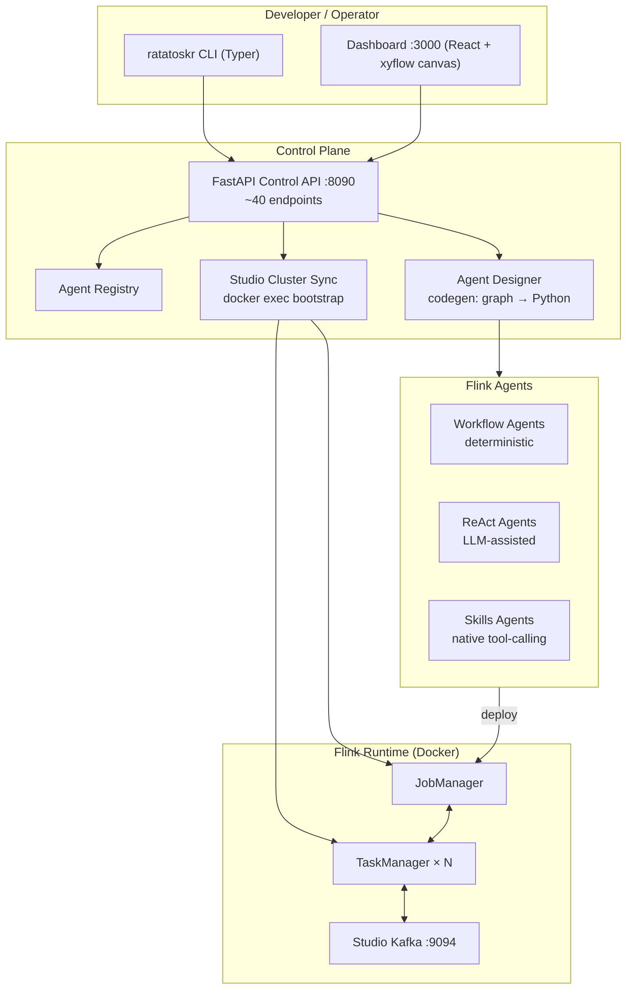

# Ratatoskr: Building Apache Flink Agents Without the Yak Shave

*How we turned a stack of PyFlink, Kafka, Docker, and LLMs into a single-command developer experience — and why a Norse squirrel is the right mascot for streaming AI.*

---

## The problem: streaming agents are theoretically easy, practically miserable

Everyone wants "AI agents on streaming data." The pitch writes itself: events flow through Kafka, an agent reasons over each one, actions ripple out in real time. Fraud detection. Honeypot triage. Anomaly hunting. Every event, understood.

Then you try to build it.

You're now three days into:

- Compiling PyFlink against the right Python version
- Fighting Pemja's classloader (hi, [FLINK-39226](https://issues.apache.org/jira/browse/FLINK-39226)) because your agent code lives in Python but Flink's runtime is Java
- Wiring `flink_agents` SDK source builds into a Docker image because the wheel isn't published yet
- Standing up a Kafka cluster that doesn't conflict with the *other* Kafka cluster you have running for the honeypot
- Writing YAML that Flink accepts, Python that Flink can invoke, and a Docker Compose file that lets them find each other
- Discovering that your ReAct agent works fine locally but silently no-ops in the cluster because a JAR wasn't copied

You haven't written a line of *agent logic* yet. You've been building infrastructure.

**Ratatoskr is what happens when you refuse to keep doing that.**

---

## What it is, in one paragraph

Ratatoskr is a workspace that gives you Apache Flink Agents on Docker with a single `pip install -e .` and a handful of CLI commands. It ships a FastAPI control plane, a React dashboard with a visual pipeline canvas, a working ReAct + workflow agent SDK integration, an optional Cowrie SSH honeypot demo that puts the whole stack through its paces, and a code generator that turns drag-and-drop node graphs into idiomatic Python Flink jobs. The name comes from the Norse squirrel who carries messages up and down Yggdrasil — an on-the-nose metaphor for event-driven pipelines.

---

## Architecture in one diagram



The point isn't the box count. It's that **you don't touch most of these boxes.** You install the package, run `ratatoskr up`, open the dashboard, and drag nodes onto a canvas. Everything below the top row is machinery.

---

## The five things that make it worth using

### 1. `ratatoskr up` actually brings up a working cluster

The state of the art for "run Flink locally with agents" is a `README` with 30 numbered steps and a `TODO: fix this on M1` comment on step 12. Ratatoskr's `docker-compose.yml` pins images, includes healthchecks, and configures the Pemja classloader workaround inline — with a citation to the upstream JIRA so the next person understands *why* the line is there:

```yaml
# JobManager environment
FLINK_PROPERTIES: |
  classloader.parent-first-patterns.additional: pemja
# Fixes FLINK-39226 — Pemja classloader conflict on Python UDFs
```

That comment is a load-bearing sentence. Someone spent an afternoon on that bug. The comment saves the next person that afternoon.

**`ratatoskr doctor` and `ratatoskr verify --tier`** turn "did it work?" into a machine-checkable question, not a vibe. Verify tiers run progressively deeper smoke tests: cluster up → agent submits → agent emits → Kafka receives. If any tier fails, you get a specific diagnosis, not a wall of Flink logs.

### 2. A visual designer that produces real Python

Most "visual agent builders" produce a JSON blob that only their own runtime can execute. Ratatoskr's Designer generates **actual Python source files** you can read, edit, commit, and diff:

```python
# generated from the designer canvas
from flink_agents.api.decorators import action, tool

class DoubleValueAgent:
    @tool
    def double(self, x: int) -> int:
        return x * 2

    @action(input_type=dict)
    def on_event(self, event: dict) -> dict:
        return {**event, "value": self.double(event["value"])}
```

Plus the matching `agent.yaml`, a manifest snippet, and a `run_local.py` for offline testing. The graph is a **starting point**, not a prison. When the designer's LLM refinement produces something almost-right, you open the file and fix it. When it produces something great, you commit it.

Three agent modes are supported:

- **Workflow** — deterministic, no LLM. Pure data transformation.
- **ReAct** — LLM-assisted with tool chaining and an explicit deterministic fallback if the LLM path fails or isn't configured.
- **Skills** — Flink's native `@chat_model_connection` + `@chat_model_setup` decorators, giving the LLM access to tools defined in Python.

### 3. Graceful degradation, everywhere

Every LLM path has a deterministic fallback. If the OpenAI-compatible endpoint isn't reachable, the pipeline-assist tool falls back to its rule-based baseline. If Cloudera credentials are missing, the honeypot's Phase-3 ReAct step doesn't crash the pipeline — it `sleep infinity`s with a log line explaining why. Every `pytest` file that touches the Flink SDK uses `pytest.importorskip("flink_agents")` so tests run whether or not the SDK is installed.

This sounds boring. It is the difference between "works on my machine" and "works when a stranger runs it three months later."

### 4. Observable by default

- **Prometheus metrics at `/metrics`** on every service that runs long enough to have any
- **SSE health stream** to the dashboard for live cluster status
- **Structured JSON logging** as an opt-in flag
- **`ratatoskr status` / `logs`** as first-class CLI commands, not "run `docker logs` yourself"

The observability isn't retrofitted. It's built into the API surface.

### 5. The honeypot demo isn't a toy

The optional `honeypot/` stack — Cowrie SSH honeypot → Kafka → Phase 1 (normalize) → Phase 2 (workflow detect) → Phase 3 (ReAct LLM enrichment) → Streamlit dashboard — exists to **stress-test the platform against adversarial real-world data**. It works. It's the kind of demo that convinces engineers because the data is genuinely nasty and the pipeline handles it.

---

## A concrete before/after

Here's what building a "double the value in every event" agent looks like without and with Ratatoskr:

### Without

```
1.  Install Java 11
2.  Download Flink 1.20
3.  Compile flink-agents from source (branch release-0.3)
4.  Set up Python 3.10 venv with pyflink pinned
5.  Debug Pemja classloader crash
6.  Read FLINK-39226
7.  Add classloader.parent-first-patterns.additional: pemja
8.  Write agent.py
9.  Write agent.yaml
10. Write Dockerfile that copies both
11. Write docker-compose.yml with JobManager + TaskManager
12. Wait for TaskManager to actually register
13. Submit job
14. Discover job silently no-ops because the Python module isn't on the classpath inside the container
15. Fix runtime sync
16. Discover Kafka bootstrap servers don't resolve inside the docker network
17. Fix network aliases
18. Submit again
19. Watch it work
```

**Elapsed time:** two to five days. Roughly 400 lines of infrastructure code before your 20 lines of business logic.

### With Ratatoskr

```bash
pip install -e .
ratatoskr up                    # cluster up, healthchecks green
ratatoskr agent list            # workflow_counter, react_double_value, ...
ratatoskr agent run workflow_counter --input '{"value": 21}'
# → {"value": 42}
```

**Elapsed time:** ~90 seconds. Zero lines of infrastructure code. Your business logic is a Python method decorated with `@tool`.

The infrastructure cost didn't disappear — someone paid it once so everyone else can skip it.

---

## What the code generator actually generates

To make the point concrete: here's what falls out of the designer when you build a ReAct agent from the canvas.

**Node graph on the canvas:**

```
[Kafka source: sessions] → [Classify: benign|scan|exploit] → [LLM enrich (if not benign)] → [Kafka sink: alerts]
```

**What Ratatoskr writes to disk:**

```
.ratatoskr/agents/session_triage/
├── agent.py               # class definition, @action wiring
├── agent_logic.py         # tools + LLM prompts, with deterministic fallback
├── agent.yaml             # Flink Agents YAML: sources, sinks, model config
├── manifest_snippet.yaml  # ready to merge into examples/agents/agent-manifest.yaml
└── run_local.py           # standalone runner for offline testing
```

The `agent_logic.py` is instructive because it embodies the "graceful degradation" principle at the code-generation level:

```python
def enrich(session: dict) -> dict:
    try:
        result = _llm_client.chat(
            model=CONNECTION,
            messages=_build_prompt(session),
            timeout=8,
        )
        return {**session, "enrichment": _parse(result)}
    except LlmNotConfiguredError:
        # deterministic fallback: rule-based enrichment
        return {**session, "enrichment": _rule_based(session)}
    except Exception as exc:
        log.warning("enrichment failed, passing through: %s", exc)
        return session
```

The LLM path is the *fast path*. The rule-based path is the *safe path*. The pipeline never blocks on the LLM.

---

## Where Ratatoskr fits in a bigger stack

Two integrations that matter:

**OpenAI-compatible LLM endpoints.** Because Ratatoskr's LLM client speaks the OpenAI wire format, it works out of the box against OpenAI, Anthropic (via any compatible shim), Cloudera-hosted inference, local Ollama, or any other endpoint that honors the same protocol. Your `react_double_value` agent doesn't know or care which one it's talking to — the connection is a config value, not a code path.

**Kafka as the substrate that makes it all real.** The reason to do this in Flink instead of a serverless function is *stateful stream processing at scale.* Windowing over session events, joining alerts against enrichment streams, exactly-once sinks — you get all of it for free the moment your agent lives inside a Flink job. Ratatoskr's job is to make the on-ramp painless enough that you'll actually try.

---

## The design choices we're most proud of

**One CLI, many concerns.** `ratatoskr` handles cluster lifecycle, agent registry, Kafka topics, tests, verification, and doctor diagnostics. New commands are loaded through a bytecode-alias bootstrap that can silently extend the tool without shipping new source. It composes.

**Two isolated Kafka clusters.** The Studio cluster on `:9094` for regular pipeline work, the honeypot cluster on `:9093` for adversarial demos. Different ports, different Compose files, zero conflict. You can bring up either without the other.

**Manifests as YAML, not code.** `examples/agents/agent-manifest.yaml` is the source of truth for what agents exist. The registry reads it; the CLI reads it; the Dashboard reads it. Adding an agent is editing YAML, not touching Python.

**Generated code is committed like any other code.** The Designer writes into `.ratatoskr/agents/` and publishes shims into `examples/agents/published_shims/`. Both are readable, greppable, editable. The visual canvas is scaffolding, not the final product.

**Test coverage is real.** 27 pytest files exercising the CLI, the API round-trips via `TestClient`, the designer's codegen, the pipeline-assist rules, agent registry validation. Not "we plan to add tests." Actual tests, actually passing.

---

## What's next

Concrete work on the roadmap:

- **Split the codegen** — `designer/definitions/compile.py` is 1,147 lines. Time to break it into `_workflow.py`, `_react.py`, `_skills.py` before it becomes 2,000.
- **A GitHub Actions workflow** to run `pytest` on PRs. Without it, the test suite is aspirational.
- **Sharper security defaults** — the API key is optional today for local-dev convenience. We want a "production mode" flag that flips the defaults: required key, tightened CORS, sanitized codegen inputs.
- **More agent examples** — session windowing, cross-stream joins, agent-to-agent handoffs. Enough breadth that "which example is closest to what I'm building" always has an answer.
- **A `CONTRIBUTING.md`** so external contributors have a path in.

Things we're *not* going to do:

- Reinvent Flink Agents. Upstream is fine; we're an on-ramp, not a fork.
- Ship a proprietary agent runtime. The generated code should run anywhere `flink_agents` runs.
- Lock users into any particular LLM provider. Anything that speaks OpenAI's chat-completions format is a valid target.

---

## Getting started

```bash
git clone https://github.com/your-org/ratatoskr
cd ratatoskr
pip install -e .
cp .env.example .env            # fill in OPENAI_API_KEY if you want ReAct agents
ratatoskr up
ratatoskr verify --tier basic   # should pass in ~30 seconds
ratatoskr agent list
```

Then open [http://localhost:3000](http://localhost:3000), click **New Agent**, drop a Kafka source, a workflow action, and a Kafka sink onto the canvas, hit **Compile**, and watch the generated Python appear in `.ratatoskr/agents/`. Submit it. Watch the events flow.

If you want the honeypot demo:

```bash
docker compose -f honeypot/docker-compose.yml up -d
# open http://localhost:8501 for the Streamlit dashboard
# ssh -p 2222 root@localhost   (from another host; don't SSH to your own honeypot)
```

---

## Why the squirrel

Ratatoskr's job in the Norse myth is to run messages up and down Yggdrasil, insulting the eagle at the top and the serpent at the roots. He is a **fast, tireless, slightly chaotic messenger** who makes it possible for events at one end of the world tree to reach the other end.

That's what a streaming agent platform is supposed to be. Fast. Tireless. Willing to carry any message anywhere. And ideally, slightly more fun to work with than a stack of YAML files and a JIRA ticket about classloaders.

We're building the squirrel.

---

*Ratatoskr is [an open source project on GitHub](https://github.com/your-org/ratatoskr). Star it if you want, open an issue if it breaks, and open a PR if you fix it before we do. The infrastructure yak is already shaved — go build agents.*
