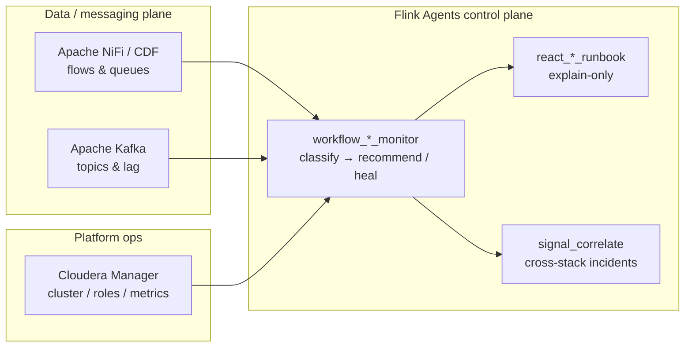
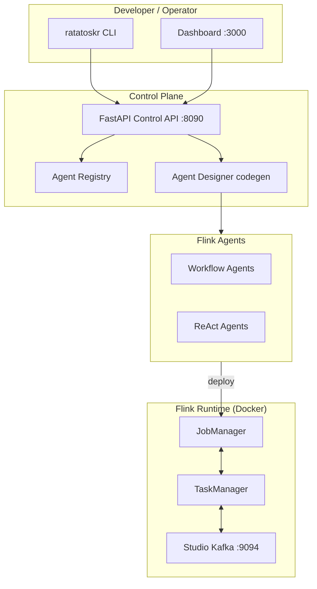

# Ratatoskr

[](LICENSE)
[](pyproject.toml)
[](METADATA.yaml)
[](METADATA.yaml)
[](https://github.com/BrooksIan/FlinkDockerWithAgents/stargazers)
[](https://github.com/BrooksIan/FlinkDockerWithAgents/watchers)
[](https://github.com/BrooksIan/FlinkDockerWithAgents/network/members)

**Cloudera Blueprint** for Apache Flink Agents on Docker — CLI, Control API, Agent Designer, Agentic Studio, and ops demos (NiFi, Kafka, CM, honeypot).

<p align="center">
  
</p>

Named for the Norse squirrel that carries messages up and down **Yggdrasil** — a fit for event pipelines, Kafka, and Flink streams. See [assets/branding/RATATOSKR.md](assets/branding/RATATOSKR.md). Catalog metadata: [`METADATA.yaml`](METADATA.yaml).

## Overview

Ratatoskr is a developer workspace for building, running, and verifying [Apache Flink Agents](https://github.com/apache/flink-agents) — primarily on **Docker Compose** for labs, with documented paths to **CDP Private Cloud Base** and **Knox VIP** gateways. It ships a Typer CLI, FastAPI Control API, React dashboard (Agent Designer + Agentic Studio), and registered workflow/ReAct agents — with a single-command path from clone to working Flink jobs.

### What is Apache Flink (and why it matters here)

[Apache Flink](https://flink.apache.org/) is an open-source engine for **stateful stream processing**: continuous jobs that read unbounded event streams (often from Kafka), keep keyed state, and emit results with low latency. Cloudera customers already meet Flink in streaming and analytics workloads.

**Flink Agents** sits on top of Flink. Instead of only writing DataStream SQL/operators, you define agents with `@action` / `@tool` graphs that can:

- run **locally** for fast iteration, or
- submit as **Flink cluster jobs** for always-on monitoring and pipelines.

So Flink’s value here is the **scalable, stateful runtime** for agentic ops — not a replacement for NiFi or Kafka. Primer: [docs/FLINK_AGENTS.md](docs/FLINK_AGENTS.md#what-is-apache-flink).

### How Flink Agents connect to NiFi, Kafka, and Cloudera Manager



| Product | Role | What Ratatoskr agents do |
|---------|------|---------------------------|
| **Kafka** | Event bus and consumer groups | Probe brokers/topics/lag; optional phased heal (`create_topic`, restart consumers) |
| **NiFi** | Integration flows (processors, queues, controller services) | Poll flow health; phased heal (`start_processor`, enable CS, lab fixes) |
| **Cloudera Manager** | Cluster service/role health | Recommend-only monitoring + runbooks (no CM mutations yet) |
| **Flink / Flink Agents** | Stream runtime + agent model | Host continuous monitors, Studio pipelines, and correlation |

**Primary use case:** continuous **monitoring**, structured **recommendations / runbooks**, and **optional gated self-healing** for NiFi and Kafka (and recommend-only visibility into CM). Agents observe those systems from the outside; they do not replace NiFi processors or Kafka brokers.

Docker lab vs CDP Base / Knox VIP: [docs/DEPLOYMENT_SCENARIOS.md](docs/DEPLOYMENT_SCENARIOS.md).

**Primary demos**

| Use case | What it demonstrates | Start here |
|----------|----------------------|------------|
| [Honeypot](#1-honeypot--cybersecurity) | Cowrie → Kafka → Flink Agents triage and enrichment | [honeypot/README.md](honeypot/README.md) |
| [NiFi monitoring](#2-nifi-flow-monitoring) | Flow health, phased heal, runbook HITL | [nifi/README.md](nifi/README.md) · [docs/NIFI_MONITOR.md](docs/NIFI_MONITOR.md) · [docs/NIFI_RUNBOOK.md](docs/NIFI_RUNBOOK.md) |
| [Kafka monitoring](#3-kafka-cluster-monitoring) | Broker/topic/lag probes and phased healing | [docs/KAFKA_MONITOR.md](docs/KAFKA_MONITOR.md) |
| [CM monitoring](#4-cloudera-manager-monitoring-cdp) | CDP/Knox CM health + recommendations | [docs/CM_MONITOR.md](docs/CM_MONITOR.md) |
| [Cross-signal](#5-cross-signal-correlation) | NiFi↔Kafka↔CM incidents, scribe, coordinated heals | [docs/SIGNAL_CORRELATE.md](docs/SIGNAL_CORRELATE.md) |

Registered agents (manifest + dashboard catalog): [`examples/agents/agent-catalog.yaml`](examples/agents/agent-catalog.yaml) · [`examples/agents/agent-manifest.yaml`](examples/agents/agent-manifest.yaml). Browse them in the dashboard at `/agents`, or via `ratatoskr agent list`.

## Demo


| | |
|---|---|
| Agent catalog |  |
| Agent Designer |  |
| Agentic Studio |  |
| Studio canvas |  |
| Runs |  |
| Settings |  |

## Use Cases

### 1. Honeypot / cybersecurity

Live SSH/Telnet honeypot (Cowrie) streams attack events through Kafka into Flink Agents: a hot-path workflow for triage (`cowrie.alerts`) and optional ReAct enrichment via Cloudera AI Inference (`cowrie.react_alerts`).

```bash
ratatoskr up --profile full
ratatoskr dashboard
```

- Dashboard: http://localhost:8501 · Flink UI: http://localhost:8081
- Details: [honeypot/README.md](honeypot/README.md)

### 2. NiFi flow monitoring

A deterministic workflow agent (`workflow_nifi_monitor`) polls NiFi health — stopped/invalid processors, queues, bulletins — and can auto-heal under gated phases (`monitor` → `safe` → `lab`). Optional ReAct agent `react_nifi_runbook` turns those facts into a structured debug runbook (Cloudera Inference or fallback; never mutates). Local labs use NiFi REST; CDP uses the same tool semantics via [NiFi-MCP-Server](https://github.com/cloudera/NiFi-MCP-Server).

```bash
ratatoskr up --profile nifi
./scripts/nifi_load_sample_flow.sh
export NIFI_HEAL_PHASE=monitor   # or safe / lab
ratatoskr agent run workflow_nifi_monitor --local
python examples/agents/run_react_nifi_runbook_local.py   # fixture; add --live after a poll
```

- NiFi UI: https://localhost:8443/nifi — login `admin` / `RatatoskrNiFi1!`
- Runbook POC: `python3 scripts/demo_nifi_runbook.py --heal --approve` · HITL before mutate · [docs/NIFI_RUNBOOK.md](docs/NIFI_RUNBOOK.md)
- Heal demos: [docs/NIFI_MONITOR.md](docs/NIFI_MONITOR.md#orchestrated-heal-examples) · `python3 scripts/demo_nifi_kafka_heal.py --list`
- Continuous: `ratatoskr monitor start` · [docs/NIFI_MONITOR.md](docs/NIFI_MONITOR.md#continuous-and-cluster)
- Details: [nifi/README.md](nifi/README.md) · [docs/NIFI_MONITOR.md](docs/NIFI_MONITOR.md)

### 3. Kafka cluster monitoring

The same phased pattern for Apache Kafka (`workflow_kafka_monitor`): probe brokers, catalog topics, partitions, and consumer lag; heal only under explicit gates (`KAFKA_HEAL_PHASE=monitor|safe|lab`).

```bash
ratatoskr kafka up
export KAFKA_HEAL_PHASE=monitor
ratatoskr agent run workflow_kafka_monitor --local
```

- Heal demos: [docs/KAFKA_MONITOR.md](docs/KAFKA_MONITOR.md#heal-demo-script-safe--lab) · continuous/cluster [docs/KAFKA_MONITOR.md](docs/KAFKA_MONITOR.md#how-kafka-monitor--heal-gets-deployed)
- Cross-stack: [docs/SIGNAL_CORRELATE.md](docs/SIGNAL_CORRELATE.md)
- Details: [docs/KAFKA_MONITOR.md](docs/KAFKA_MONITOR.md)

### 4. Cloudera Manager monitoring (CDP)

Read-only CM health polling (`workflow_cm_monitor`): services, roles, grouped events (Impala SPNEGO, state fetcher, …), timeseries thresholds (HDFS capacity, Kafka under-replication), and structured recommendations. Knox via `CM_API_BASE` + `KNOX_TOKEN`. `react_cm_runbook` explains findings; never mutates CM.

```bash
export KNOX_TOKEN='<jwt>'   # .env has CM_API_BASE / CM_CLUSTER
.venv/bin/python scripts/cm_monitor_live_probe.py
.venv/bin/python examples/agents/run_react_cm_runbook_local.py --live
ratatoskr monitor start --agent cm --no-nifi --no-kafka --interval 60
```

- Details: [docs/CM_MONITOR.md](docs/CM_MONITOR.md)

### 5. Cross-signal correlation

Deterministic correlation of NiFi + Kafka + CM monitor OutputEvents (`workflow_signal_correlate`), optional ReAct brief (`react_incident_scribe`) or structured cross runbook (`react_cross_runbook`, never mutates), and gated coordinated heals (`workflow_cross_stack_heal`).

```bash
python examples/agents/run_workflow_signal_correlate_local.py --demo
python examples/agents/run_workflow_signal_correlate_local.py --demo-cm
export KNOX_TOKEN='<jwt>'
python examples/agents/run_workflow_signal_correlate_local.py   # live + CM when configured
python examples/agents/run_react_incident_scribe_local.py
python3 scripts/demo_cross_runbook.py --scenario topic-missing --heal --approve
# Live: python3 scripts/demo_cross_runbook.py --live --inject --heal --approve
python3 scripts/demo_nifi_kafka_heal.py --scenario cross-topic
```

- Details: [docs/SIGNAL_CORRELATE.md](docs/SIGNAL_CORRELATE.md)

## Agent catalog

All runnable agents are registered in:

| File | Role |
|------|------|
| [`examples/agents/agent-catalog.yaml`](examples/agents/agent-catalog.yaml) | Dashboard catalog — categories, display names, I/O schemas |
| [`examples/agents/agent-manifest.yaml`](examples/agents/agent-manifest.yaml) | Runtime registry — entry points, local/cluster runners |

```bash
ratatoskr agent list
ratatoskr agent describe workflow_counter
ratatoskr agent run workflow_counter --local
```

How to add agents and example runners: [examples/README.md](examples/README.md).

## Agent Designer & Agentic Studio

The React dashboard includes two visual tools for authoring agents and composing them into pipelines. Start the Control API and UI (`ratatoskr api start` + `./scripts/dev-start.sh`), then open http://localhost:3000.

### Agent Designer (`/designer`)

Build **workflow** and **ReAct** agents on a canvas without hand-editing Python:

1. **Create agent** — Workflow or ReAct template
2. Edit nodes and edges — actions, tools, LLM / MCP nodes; auto-save and validate
3. **Compile** — emits Python, Flink YAML, manifest snippet, and a local runner under `.ratatoskr/agents/{id}/`

ReAct agents need an LLM under **Settings**. Details: [dashboard/README.md](dashboard/README.md) · [docs/AGENT_DESIGNER_PLAN.md](docs/AGENT_DESIGNER_PLAN.md).

### Agentic Studio (`/studio`)

Compose **linear multi-agent pipelines** (Source → optional window → Agent(s) → Sink) from catalog and Designer agents:

- **Canvas** — Source (records or Kafka), dynamic session window, agents from the [catalog](examples/agents/agent-catalog.yaml), Capture or Kafka sink
- **Build with assistant** — guided form → pipeline draft; optional LLM refine; can suggest missing agents before create
- **Run locally** or **Run on Flink cluster** — history under `/runs`; Kafka sink default topic `workflow.test.output`

Kafka sources require a dynamic session window (enforced for cluster submit). Cluster runs need Studio Kafka (`ratatoskr kafka up`) and the minimal Flink stack. Templates include Counter → Echo and the Yggdrasil event pipeline.

Pipelines persist in `.ratatoskr/pipelines.db`. Full page guide: [dashboard/README.md](dashboard/README.md#agentic-studio).

## Quickstart

```bash
git clone https://github.com/BrooksIan/FlinkDockerWithAgents.git
cd FlinkDockerWithAgents
pip install -e .
cp .env.example .env   # optional Studio defaults

ratatoskr build
ratatoskr up           # JobManager + TaskManager
ratatoskr kafka up     # Studio Kafka on :9094
ratatoskr api start

curl http://127.0.0.1:8090/v1/health
ratatoskr agent list
ratatoskr doctor
```

Dashboard (optional):

```bash
./scripts/dev-start.sh   # http://localhost:3000
# Stop: ./scripts/dev-stop.sh
```

After code or image updates: `./scripts/restart-studio-cluster.sh` (`--dev`, `--build --dev`, or `--sync-only`).

| URL | Service |
|-----|---------|
| http://localhost:3000 | Dashboard (dev) |
| http://localhost:8082 | Flink Web UI (minimal / Studio) |
| http://localhost:8081 | Flink Web UI (honeypot / full) |
| http://localhost:9094 | Studio Kafka bootstrap |
| http://127.0.0.1:8090/docs | Control API (Swagger) |

## Architecture



| Component | Role |
|-----------|------|
| Apache Flink + Flink Agents | Streaming runtime and agent SDK |
| Docker Compose (`deploy/`) | JobManager, TaskManager, Studio Kafka |
| `ratatoskr` CLI / Control API | Build, stack, agents, health |
| React dashboard | Overview, catalog, Designer, Studio, Runs |
| Optional Cowrie (`honeypot/`) | Cybersecurity reference pipeline |
| Optional Apache NiFi (`nifi/`) | Flow monitoring / healing lab |
| Cloudera AI Inference (optional) | Hosted **chat completions** for honeypot / ReAct runbooks — stock model + prompts/tools/catalogs; **this blueprint does not fine-tune or train domain-specific weights** |

Platform details: [docs/PLATFORM.md](docs/PLATFORM.md).

## Repository structure

| Path | Description |
|------|-------------|
| `ratatoskr/` | CLI + Control API |
| `examples/agents/` | Agent catalog, manifest, and runners |
| `dashboard/` | React UI |
| `deploy/` | Docker Compose and image build |
| `honeypot/` | Cowrie honeypot demo |
| `nifi/` | NiFi monitoring lab |
| `docs/` | Platform and use-case guides |
| `scripts/` | Dev start/stop, cluster restart, fault injectors |
| `test/` | CLI and platform tests |

## Prerequisites

- Docker and Docker Compose v2
- Python 3.12+ (host CLI / Control API; Docker image uses Flink **2.1** + Python **3.12**)
- Git (image build clones `apache/flink-agents`)
- Optional: Node.js for dashboard development
- Optional honeypot / LLM: `CLOUDERA_AI_BASE_URL`, `CLOUDERA_JWT_TOKEN` in `.env`
- Optional NiFi lab: `NIFI_*` vars (see `.env.example`)

Local dev: leave `RATATOSKR_API_KEY` unset. Create a venv with Python 3.12+:

```bash
python3.12 -m venv .venv
source .venv/bin/activate
pip install -e .
```

Rebuild the Flink Agents image after this upgrade:

```bash
ratatoskr build
```

## Hardware requirements

| Deployment | Minimum |
|------------|---------|
| Minimal + Studio Kafka | 4 CPU, 8 GB RAM, 20 GB disk |
| NiFi profile | 6 CPU, 12 GB RAM, 30 GB disk |
| Full profile (honeypot) | 8 CPU, 16 GB RAM, 40 GB disk |

## Documentation

- [docs/PLATFORM.md](docs/PLATFORM.md) — Control API, agents, Studio, dashboard
- [docs/FLINK_AGENTS.md](docs/FLINK_AGENTS.md) — Workflow vs ReAct
- [docs/AGENT_DESIGNER_PLAN.md](docs/AGENT_DESIGNER_PLAN.md) — Agent Designer authoring and codegen
- [docs/NIFI_MONITOR.md](docs/NIFI_MONITOR.md) — NiFi monitoring / healing demos
- [docs/NIFI_RUNBOOK.md](docs/NIFI_RUNBOOK.md) — ReAct runbooks + HITL approve before heal
- [docs/CUSTOMER_POC.md](docs/CUSTOMER_POC.md) — Data-plane customer demo (propose → ack → apply)
- [docs/KAFKA_MONITOR.md](docs/KAFKA_MONITOR.md) — Kafka monitoring / healing demos
- [docs/SIGNAL_CORRELATE.md](docs/SIGNAL_CORRELATE.md) — Cross-signal correlation, scribe, cross-stack heals
- [docs/README.md](docs/README.md) — Documentation index (incl. Mermaid diagram map)
- [examples/README.md](examples/README.md) — Example agents
- [examples/agents/agent-catalog.yaml](examples/agents/agent-catalog.yaml) — Agent catalog
- [ratatoskr/README.md](ratatoskr/README.md) — CLI reference
- [dashboard/README.md](dashboard/README.md) — Dashboard, Designer, and Studio
- [honeypot/README.md](honeypot/README.md) — Honeypot demo
- [nifi/README.md](nifi/README.md) — NiFi lab
- [deploy/README.md](deploy/README.md) — Compose / image layout
- [Apache Flink Agents docs](https://nightlies.apache.org/flink/flink-agents-docs-release-0.3/)

## License

This project is licensed under the [Apache License 2.0](LICENSE).

## Disclaimer

*This blueprint is intended for Proof-of-Concept and research use only. It is not designed for production deployment. Use in production environments is at the user's own risk. The authors and contributors accept no liability for operational impacts or damages.*
