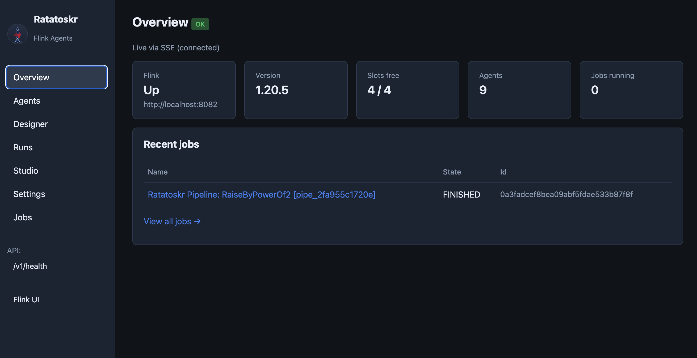
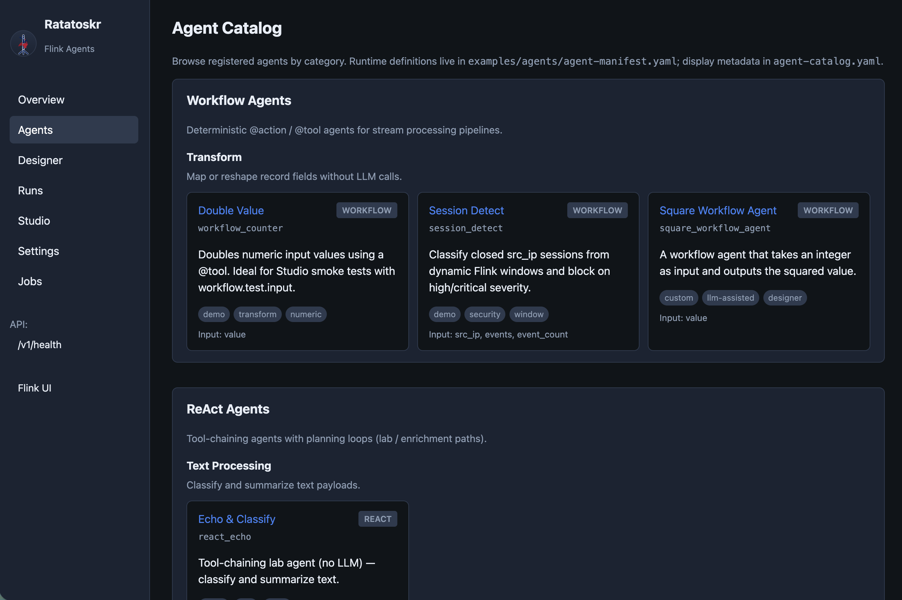
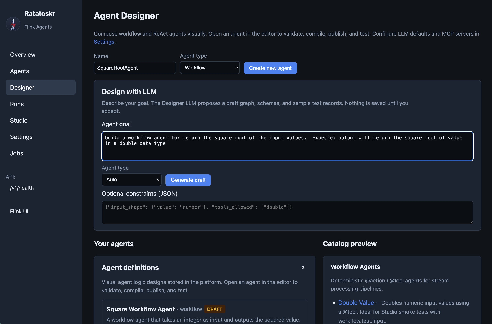
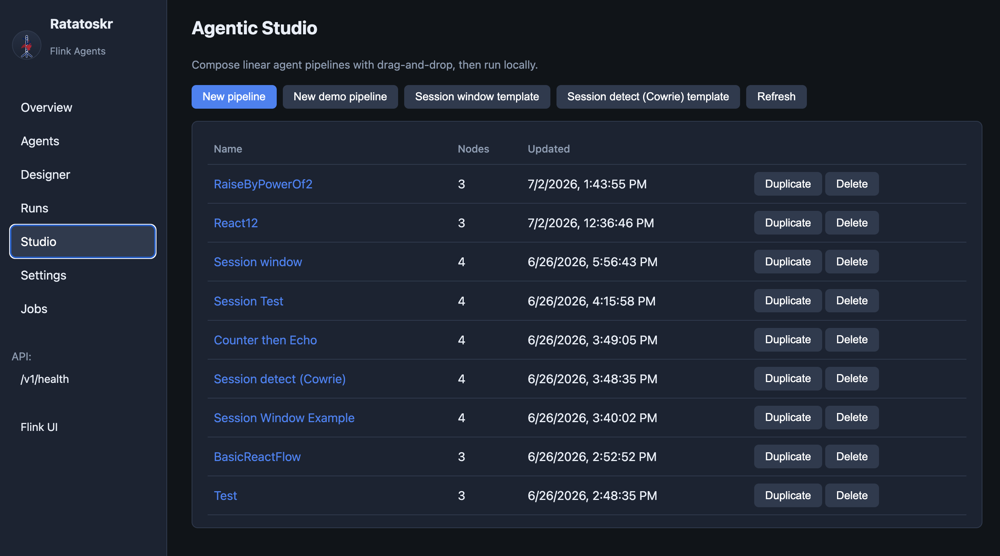
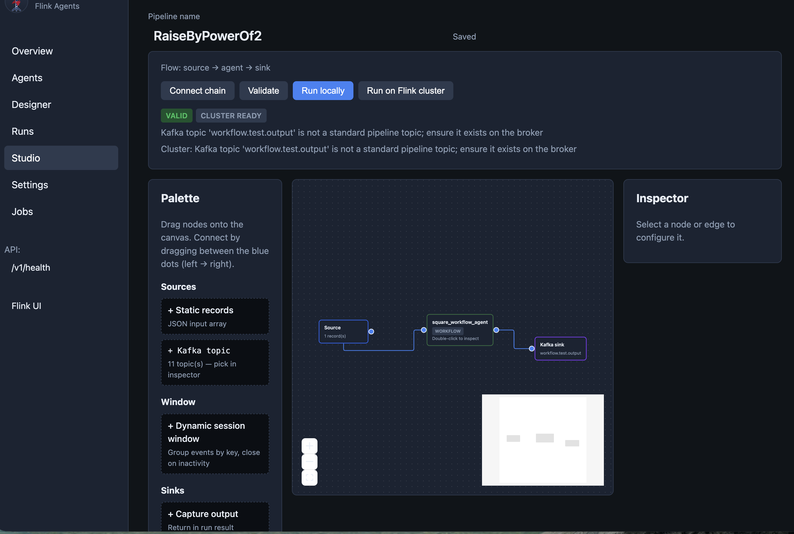
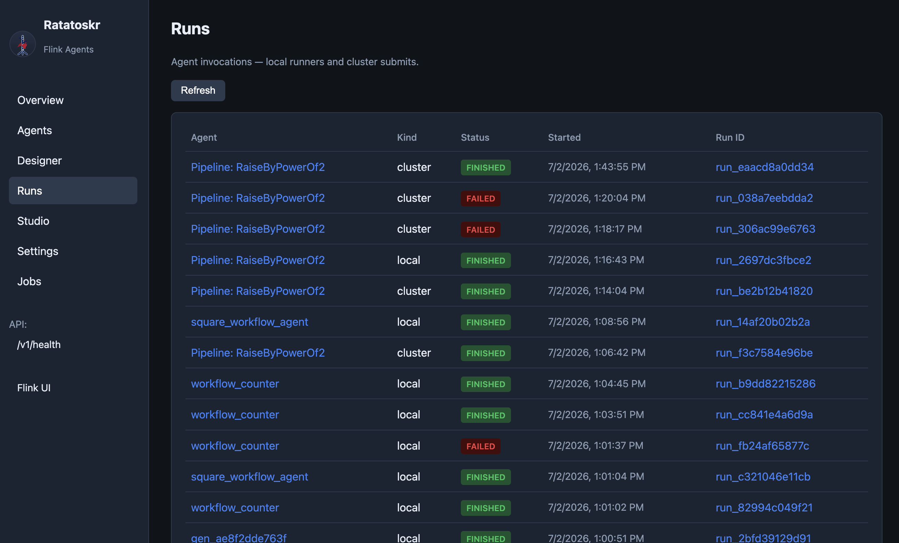
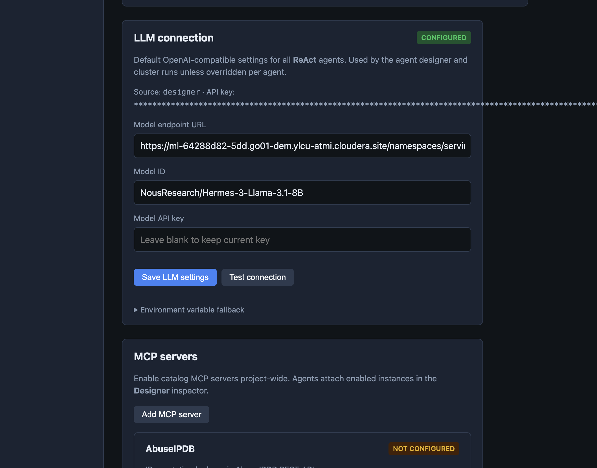
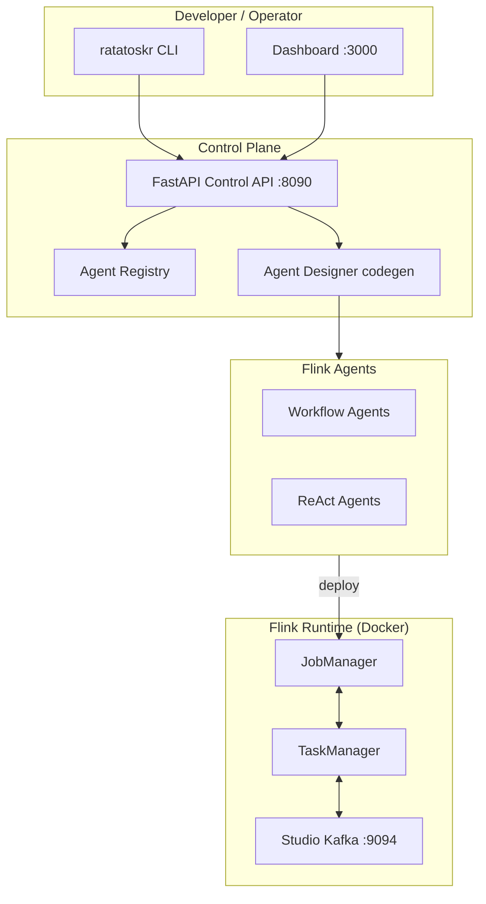

# Cloudera Blueprint: Ratatoskr — Apache Flink Agents on Docker

<p align="center">
  
</p>

> Catalog and website fields live in [`METADATA.yaml`](METADATA.yaml). After reading this, you should understand how the blueprint works, its purpose, and how to deploy it yourself.

Named for the Norse squirrel that carries messages up and down **Yggdrasil** — a fit for event pipelines, Kafka, and Flink streams. See [assets/branding/RATATOSKR.md](assets/branding/RATATOSKR.md).

## Table of Contents

- [Overview](#overview)
- [Demo](#demo)
- [Use Case](#use-case)
- [Key Features](#key-features)
- [Quickstart](#quickstart--guide)
- [Software Components](#architecture--software-components)
- [Target Audience](#target-audience)
- [Repository Structure](#repository-structure)
- [Prerequisites](#prerequisites)
- [Hardware Requirements](#hardware-requirements)
- [Documentation](#documentation)

## Overview

Ratatoskr is a developer workspace for building, running, and verifying [Apache Flink Agents](https://github.com/apache/flink-agents) on Docker. It ships a Typer CLI, FastAPI Control API, React dashboard with visual Agent Designer and Agentic Studio, example workflow/ReAct agents, an optional **Apache NiFi flow monitoring and healing** lab, and an optional Cowrie honeypot pipeline that demonstrates Cloudera Data in Motion plus Cloudera AI Inference on streaming security events. The goal is a single-command path from clone to working Flink agent jobs — without the usual PyFlink, Kafka, and image-build yak shave.

## Demo

Dashboard walkthrough (screenshots):



| | |
|---|---|
| Agent catalog |  |
| Agent Designer |  |
| Agentic Studio |  |
| Studio canvas |  |
| Runs |  |
| Settings |  |

> Reprise / recorded walkthrough: set `reprise_link` in [`METADATA.yaml`](METADATA.yaml) when published.

Optional honeypot demo: [honeypot/README.md](honeypot/README.md). Optional NiFi monitoring lab: [nifi/README.md](nifi/README.md).

## Use Case

Streaming AI agents are easy to pitch and hard to stand up: PyFlink classloaders, unpublished SDK wheels, Kafka port conflicts, and cluster submit gaps burn days before any agent logic ships. Ratatoskr collapses that into a reproducible Docker stack so teams can focus on workflow and ReAct agent design for real-time triage, enrichment, and automation — including cybersecurity honeypot alerting as a reference vertical.

A second blueprint path targets **Apache NiFi flow monitoring and healing**: a deterministic workflow agent polls NiFi health (stopped/invalid processors, queues, bulletins) and can auto-heal under gated phases (`monitor` → `safe` → `lab`). Local labs use NiFi REST; CDP uses the same tool semantics via [NiFi-MCP-Server](https://github.com/cloudera/NiFi-MCP-Server).

## Key Features

- One-command Flink Agents cluster (`ratatoskr up`) with pinned image build and Pemja classloader workaround
- CLI + Control API for agent list/run/submit, health, and dashboard integration
- Visual Agent Designer and Agentic Studio (source → agent → sink pipelines, codegen to Python)
- Studio Kafka independent of the optional honeypot stack
- Optional **NiFi monitoring / healing** profile (`ratatoskr up --profile nifi`) with phased workflow agent
- Optional Cowrie honeypot reference pipeline with Cloudera AI enrichment
- Verify tiers (`quick` / `standard` / `full` / `nightly`) for CI-friendly smoke checks

## Quickstart / Guide

1. Clone the repository and install the package:

```bash
git clone https://github.com/BrooksIan/FlinkDockerWithAgents.git
cd FlinkDockerWithAgents
pip install -e .
```

2. Copy [`.env.example`](.env.example) to `.env` (optional for local Studio defaults):

```bash
RATATOSKR_PROFILE=minimal
FLINK_REST_PORT=8082
KAFKA_BOOTSTRAP_SERVERS=localhost:9094
RATATOSKR_API_PORT=8090
```

3. Build the image and start the minimal stack + Studio Kafka:

```bash
ratatoskr build
ratatoskr up                    # JobManager + TaskManager
ratatoskr kafka up              # Studio Kafka on :9094
```

4. Start the Control API and list agents:

```bash
ratatoskr api start
curl http://127.0.0.1:8090/v1/health
ratatoskr agent list
ratatoskr agent run workflow_counter --local
ratatoskr doctor
ratatoskr verify --tier quick
```

5. (Optional) Dashboard UI:

```bash
./scripts/dev-start.sh
# Dashboard: http://localhost:3000
# Stop: ./scripts/dev-stop.sh
```

6. (Optional) NiFi flow monitoring lab:

```bash
ratatoskr up --profile nifi
# UI: https://localhost:8443/nifi  — login admin / RatatoskrNiFi1!  (see nifi/README.md)
./scripts/nifi_load_sample_flow.sh
export NIFI_HEAL_PHASE=monitor   # or safe / lab
ratatoskr agent run workflow_nifi_monitor --local
```

See [nifi/README.md](nifi/README.md) (credentials + heal phases) and [docs/NIFI_MONITOR.md](docs/NIFI_MONITOR.md).

**After code or image updates**, restart the Studio cluster:

```bash
./scripts/restart-studio-cluster.sh
./scripts/restart-studio-cluster.sh --dev          # + API + dashboard
./scripts/restart-studio-cluster.sh --build --dev  # rebuild image + dev stack
./scripts/restart-studio-cluster.sh --sync-only     # hot-sync code, no container restart
```

**Optional honeypot:**

```bash
ratatoskr up --profile full    # Cowrie + Kafka + dashboard
ratatoskr dashboard
```

| URL | Service |
|-----|---------|
| http://localhost:3000 | Dashboard (dev) |
| http://localhost:8082 | Flink Web UI (minimal / Studio stack) |
| http://localhost:8081 | Flink Web UI (honeypot / full profile) |
| http://localhost:9094 | Studio Kafka bootstrap (host) |
| http://127.0.0.1:8090/docs | Control API (Swagger) |
| http://127.0.0.1:8090/v1/health | Pipeline health |

## Architecture / Software Components



| Component | Role |
|-----------|------|
| Apache Flink + Flink Agents | Streaming runtime and agent SDK |
| Docker Compose (`deploy/`) | JobManager, TaskManager, Studio Kafka |
| `ratatoskr` CLI / Control API | Build, stack, agents, health, OpenAPI |
| React dashboard | Overview, Designer, Studio, Runs, Settings |
| Optional Apache NiFi (`nifi/`) | Flow monitoring / healing lab + sample flow |
| Optional Cowrie honeypot | End-to-end cybersecurity reference pipeline |
| Cloudera AI Inference (optional) | LLM enrichment for honeypot / ReAct agents |
| NiFi-MCP (CDP dual path) | Same heal ops via Knox — [NiFi-MCP-Server](https://github.com/cloudera/NiFi-MCP-Server) |

Extended narrative: [docs/Blog.md](docs/Blog.md). Platform details: [docs/PLATFORM.md](docs/PLATFORM.md).

## Target Audience

- Data / streaming engineers building Flink Agents workloads
- ML / AI engineers wiring ReAct or workflow agents to Kafka streams
- Solution architects evaluating Cloudera Data in Motion + AI Inference patterns
- Security engineers exploring honeypot → stream → agent triage demos

## Repository Structure

| Path | Description |
| --- | --- |
| `assets/` | Diagrams, screenshots, branding media |
| `deploy/` | Docker Compose, Dockerfile, legacy compose pointers |
| `docs/` | Extended documentation and guides |
| `METADATA.yaml` | Catalog metadata for the Cloudera blueprint website |
| `ratatoskr/` | CLI + Control API package |
| `examples/` | Generic Flink Agents demos and agent registry |
| `dashboard/` | Web UI — Overview, Agents, Designer, Studio, Runs, Jobs |
| `honeypot/` | Optional Cowrie honeypot reference pipeline |
| `nifi/` | Optional Apache NiFi monitoring / healing lab |
| `scripts/` | Dev start/stop, Studio cluster restart, NiFi sample/fault scripts |
| `test/` | CLI and platform tests |

## Prerequisites

- Docker and Docker Compose v2
- Python 3.10+
- Git (image build clones `apache/flink-agents`)
- Optional: Node.js for dashboard development (`dashboard/`)
- Optional honeypot / LLM: Cloudera AI Inference endpoint + JWT (`CLOUDERA_AI_BASE_URL`, `CLOUDERA_JWT_TOKEN` in `.env`)
- Optional NiFi lab: `NIFI_API_BASE`, `NIFI_USERNAME`, `NIFI_PASSWORD`, `NIFI_HEAL_PHASE` (see `.env.example`)

Local dev: leave `RATATOSKR_API_KEY` unset. See [`.env.example`](.env.example).

## Hardware Requirements

| Deployment | Minimum |
| --- | --- |
| Launchable / demo (minimal + Kafka) | 4 CPU, 8 GB RAM, 20 GB disk |
| NiFi profile (Flink + NiFi) | 6 CPU, 12 GB RAM, 30 GB disk |
| Full profile (honeypot + Flink + Kafka) | 8 CPU, 16 GB RAM, 40 GB disk |
| Production / enterprise | Size Flink TaskManagers and Kafka to event volume; GPU optional only if hosting local LLMs |

TaskManager compose default process memory is 4 GB (`taskmanager.memory.process.size: 4096m`).

## Documentation

- [docs/PLATFORM.md](docs/PLATFORM.md) — Control API, agents, observability, dashboard integration
- [docs/FLINK_AGENTS.md](docs/FLINK_AGENTS.md) — Workflow vs ReAct agents
- [docs/NIFI_MONITOR.md](docs/NIFI_MONITOR.md) — NiFi flow monitoring / healing workflow agent
- [nifi/README.md](nifi/README.md) — NiFi lab quickstart and heal phases
- [docs/Blog.md](docs/Blog.md) — Narrative overview and design rationale
- [docs/AGENT_DESIGNER_PLAN.md](docs/AGENT_DESIGNER_PLAN.md) — Visual authoring and codegen roadmap
- [assets/branding/RATATOSKR.md](assets/branding/RATATOSKR.md) — Name, mythology, brand assets
- [dashboard/README.md](dashboard/README.md) — Dashboard pages and dev setup
- [ratatoskr/README.md](ratatoskr/README.md) — Full CLI command reference
- [examples/README.md](examples/README.md) — Example agents and demos
- [honeypot/README.md](honeypot/README.md) — Cowrie cybersecurity demo (optional)
- [Apache Flink Agents docs](https://nightlies.apache.org/flink/flink-agents-docs-release-0.3/)
- [NiFi-MCP-Server](https://github.com/cloudera/NiFi-MCP-Server) — CDP dual-path MCP

## License

Apache License 2.0
