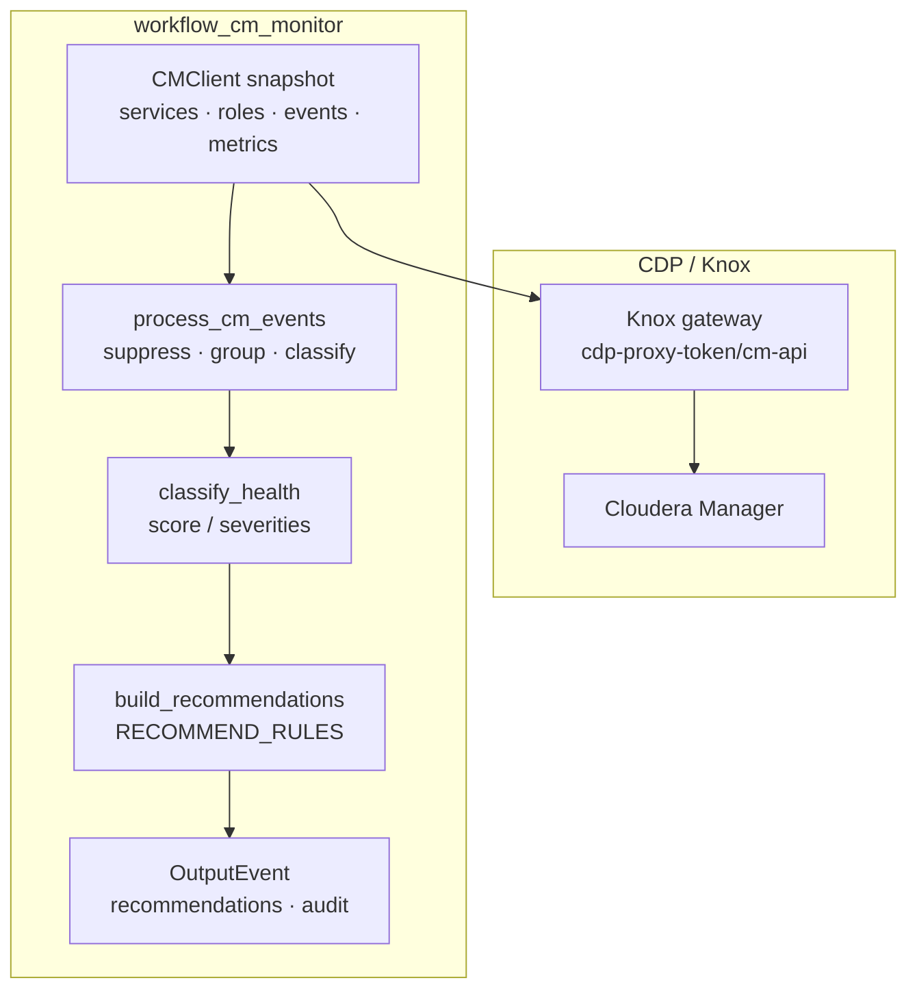

# Cloudera Manager monitoring with Flink Agents

Read-only **workflow agent** pattern for CDP / Cloudera Manager cluster health: poll CM REST API, classify severities, emit structured **fix recommendations** (no mutations). Pairs with `react_cm_runbook` for operator checklists and `workflow_signal_correlate` for NiFi↔Kafka↔CM cross-signal incidents.

## Why a workflow agent

CM remediation should be **deterministic and auditable**: same health snapshot → same classification → same recommendations. That matches the [workflow agent](FLINK_AGENTS.md#workflow-agents) model. This agent is **recommend-only** — no `CM_HEAL_PHASE` yet (see roadmap in [SIGNAL_CORRELATE.md](SIGNAL_CORRELATE.md)).

## Architecture



Cross-stack: [SIGNAL_CORRELATE.md](SIGNAL_CORRELATE.md) · Runbook: below.

## Components

| Piece | Role |
|-------|------|
| `ratatoskr/cm/client.py` | Read-only `CMClient` — clusters, services, roles, hosts, events, parcels, timeseries |
| `ratatoskr/cm/events.py` | Event normalization, suppression, grouping (`impala_spnego`, `impala_state_fetcher`, …) |
| `ratatoskr/cm/metrics.py` | Timeseries checks (HDFS capacity, Kafka under-replication) |
| `ratatoskr/cm/policy.py` | `classify_health`, `diff_health`, `run_monitor_cycle` |
| `ratatoskr/cm/recommendations.py` | CDP-specific recommendation catalog |
| `workflow_cm_monitor` | Flink Agents workflow agent |
| `react_cm_runbook` | Explain-only runbook from monitor facts (never mutates CM) |

## Severities

| Severity | Meaning |
|----------|---------|
| `CM_UNREACHABLE` | API probe or Knox auth failed |
| `CLUSTER_BAD` | Cluster health summary BAD/CONCERNING |
| `SERVICE_DOWN` / `SERVICE_BAD` | Stopped or unhealthy services |
| `ROLE_DOWN` | Stopped roles |
| `HEALTH_CHECK_FAIL` | Failed service/role health checks |
| `HOST_BAD` / `HOST_DECOMMISSIONED` | Host health or commission state |
| `EVENT_CRITICAL` / `EVENT_WARN` | Grouped CM events (after suppression) |
| `CONFIG_STALE` | Stale client configs |
| `PARCEL_ERROR` / `COMMAND_FAILED` | Parcel or command failures |
| `MGMT_UNHEALTHY` | CM management service unhealthy |
| `HDFS_CAPACITY_HIGH` | Timeseries HDFS used/capacity above threshold |
| `KAFKA_UNDER_REPLICATED` | Timeseries under-replicated partitions |
| `CM_SLOW` | Poll latency above `CM_PROBE_SLOW_MS` |

## Event intelligence (P0)

Raw CM events are noisy on CDP demos (e.g. repeated ZK SSL keystore warnings). `process_cm_events`:

- **Suppresses** known low-value patterns (default: `zookeeper.ssl.keyStore.location not specified`)
- **Groups** duplicates by fingerprint / `event_kind`
- **Classifies** CDP patterns → targeted recommendations (`impala_spnego_auth`, `impala_state_fetcher_failure`, …)

Override suppressions: `CM_EVENT_SUPPRESS_PATTERNS=none` or comma-separated regexes.

## Timeseries metrics (P2)

When HDFS and/or Kafka services exist on the cluster, the monitor polls CM timeseries:

| Check | Severity | Default threshold |
|-------|----------|-------------------|
| HDFS `dfs_capacity_used / dfs_capacity` | `HDFS_CAPACITY_HIGH` | 85% (`hdfs_capacity_pct`) |
| Kafka `under_replicated_partitions` | `KAFKA_UNDER_REPLICATED` | ≥1 (`kafka_under_replicated_min`) |

Results appear in `health.metrics` and `health.metric_breaches`.

## Env

| Variable | Default | Meaning |
|----------|---------|---------|
| `CM_API_BASE` | — | CM API URL (direct `:7183` or Knox `.../cdp-proxy-token/cm-api`) |
| `KNOX_TOKEN` | — | Bearer JWT for Knox (export in shell — do not commit) |
| `CM_CLUSTER` | — | Cluster name (auto-discovered from hosts when empty) |
| `CM_USER` / `CM_PASSWORD` | — | Basic auth when not using Knox |
| `CM_VERIFY_SSL` | `1` | TLS verification |
| `CM_REQUEST_TIMEOUT_SEC` | `30` | HTTP timeout |
| `CM_PROBE_SLOW_MS` | `5000` | Slow poll threshold |
| `CM_EVENT_LOOKBACK_SEC` | `300` | Event window for grouping |
| `CM_METRIC_THRESHOLDS` | see above | JSON thresholds for timeseries |
| `CM_CONSOLE_BASE` | derived | CM UI base for recommendation deep links |
| `CM_EVENT_SUPPRESS_PATTERNS` | ZK keystore | `none` disables built-in suppressions |

Copy from [`.env.example`](../.env.example). Local runners load `.env` automatically; **`KNOX_TOKEN` must still be exported** in your shell.

### CDP via Knox (example)

```bash
# .env
CM_API_BASE=https://<gateway>/<env>/cdp-proxy-token/cm-api
CM_CLUSTER=worldwidebank

# shell (session)
export KNOX_TOKEN='<jwt>'
```

## Run locally

```bash
# One-shot probe (JSON)
.venv/bin/python scripts/cm_monitor_live_probe.py

# One-shot or continuous monitor
.venv/bin/python examples/agents/run_workflow_cm_monitor_local.py
.venv/bin/python examples/agents/run_workflow_cm_monitor_local.py --continuous --interval 60

# Host orchestration (NiFi + Kafka + CM)
ratatoskr monitor start --agent cm --no-nifi --no-kafka --interval 60
```

### Structured runbook (ReAct, never mutates)

```bash
# Offline fixture (Impala SPNEGO + state fetcher)
.venv/bin/python examples/agents/run_react_cm_runbook_local.py

# Live: poll CM then build runbook
export KNOX_TOKEN='<jwt>'
.venv/bin/python examples/agents/run_react_cm_runbook_local.py --live
```

### Cross-signal correlation

```bash
export KNOX_TOKEN='<jwt>'
# Loads .env (CM_API_BASE, CM_CLUSTER); polls NiFi + Kafka + CM + data-plane
.venv/bin/python examples/agents/run_workflow_signal_correlate_local.py

# Offline CM + NiFi + Kafka incident demo
.venv/bin/python examples/agents/run_workflow_signal_correlate_local.py --demo-cm

# Skip CM on live runs
.venv/bin/python examples/agents/run_workflow_signal_correlate_local.py --no-cm
```

Solo-side CM faults appear as `cm_only:EVENT_CRITICAL,CM_SLOW` with `cross_signal: false` until a second side (NiFi/Kafka) matches a [CM correlation rule](SIGNAL_CORRELATE.md#rules).

## Interpreting live output

| Observation | Likely meaning |
|-------------|----------------|
| `suppressed_events` > 0 | ZK/noise filtered — check `critical_events` for real issues |
| `EVENT_CRITICAL` + Impala kinds | CM metrics/auth or state fetcher — see Impala in CM UI |
| `CM_SLOW` | Knox + full snapshot slow; raise `CM_PROBE_SLOW_MS` or reduce `CM_EVENT_LOOKBACK_SEC` |
| `metric_breaches` empty | HDFS/Kafka capacity within thresholds |
| Score 80 with only `CM_SLOW` | Healthy cluster aside from poll latency |

## Tests

```bash
python3 test/test_cm_monitor.py
python3 test/test_cm_runbook.py
python3 test/test_cm_metrics.py
python3 test/test_signal_correlate.py
```

## Related

- [SIGNAL_CORRELATE.md](SIGNAL_CORRELATE.md) — NiFi↔Kafka↔CM incidents
- [FLINK_AGENTS_CDF_FLOWS.md](FLINK_AGENTS_CDF_FLOWS.md) — CDF + platform context
- [NIFI_RUNBOOK.md](NIFI_RUNBOOK.md) — Runbook envelope pattern (same JSON shape)
