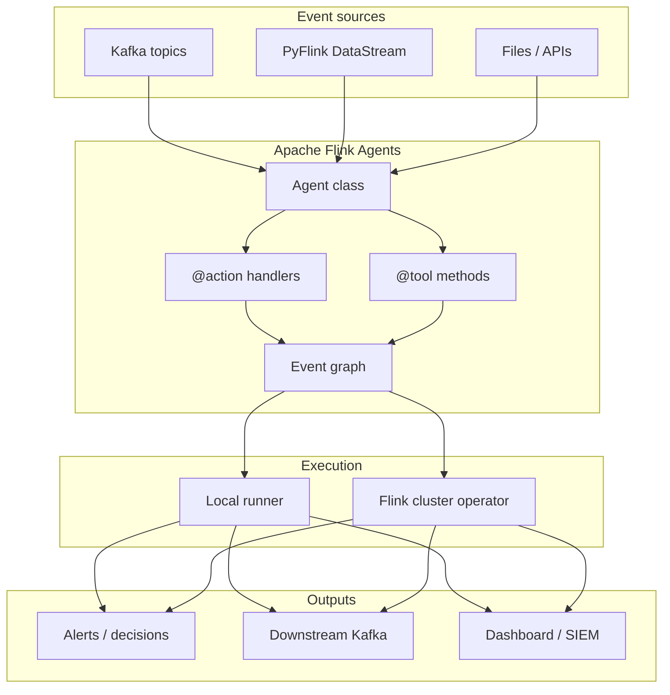
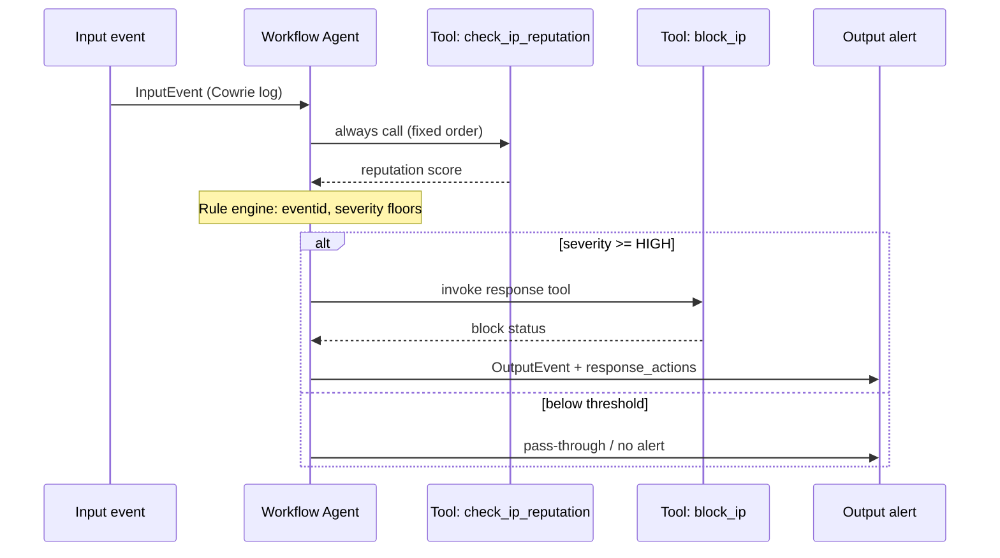
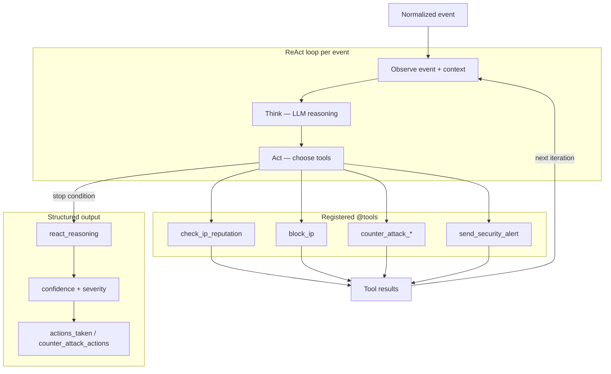
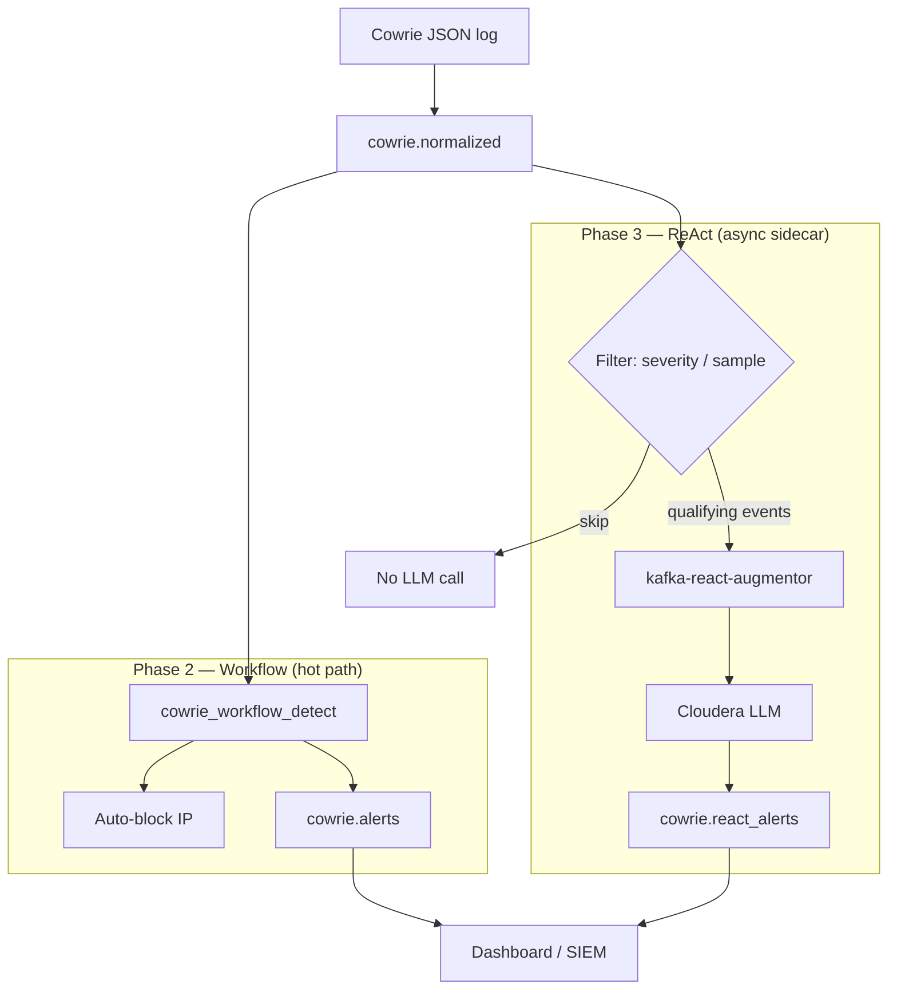
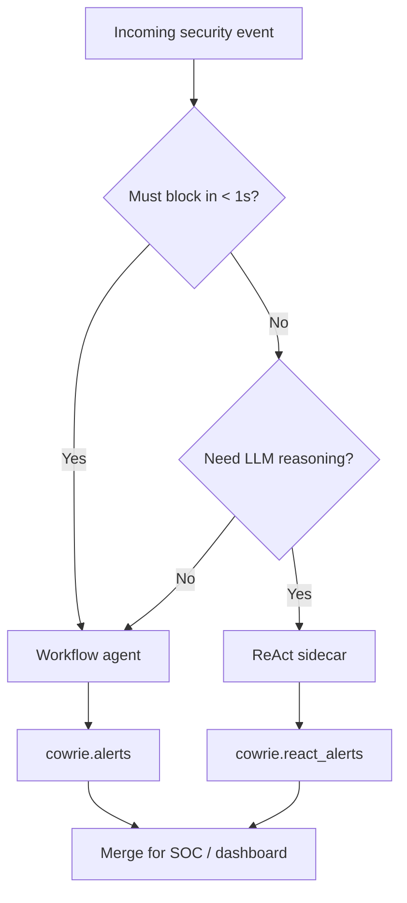

# Apache Flink Agents — Workflow vs ReAct

A practical review of the two agent paradigms in [Apache Flink Agents](https://github.com/apache/flink-agents) (release 0.3), with diagrams and guidance drawn from this workspace’s Cowrie honeypot pipeline.

**Related docs**

- [PRODUCTION_ARCHITECTURE.md](PRODUCTION_ARCHITECTURE.md) — hot path vs enrichment in production
- [honeypot/README.md](../honeypot/README.md) — end-to-end demo
- [Flink Agents 0.3 docs](https://nightlies.apache.org/flink/flink-agents-docs-release-0.3/) — upstream API reference

---

## What Flink Agents adds to Flink

Apache Flink already excels at stateful stream processing. **Flink Agents** layers an agent programming model on top: you define an `Agent` with **`@action`** handlers (event-driven steps) and **`@tool`** methods (callable capabilities). Events flow through a graph; the same agent can run in a **local runner** (development, sidecars) or as a **Flink operator** on the cluster via `AgentsExecutionEnvironment`.



*Source: [`docs/images/flink-agents-overview.mmd`](images/flink-agents-overview.mmd)*

Typical building blocks:

| Concept | Role |
|---------|------|
| `Agent` | Container for actions and tools |
| `@action(InputEvent)` | Entry point; runs when an input event arrives |
| `@tool` | Named capability the agent (or LLM) can invoke |
| `RunnerContext` | Resources, tool calls, state during execution |
| `OutputEvent` | Structured result emitted to the next step |

---

## Workflow agents

### What they are

**Workflow agents** use an **explicit, code-defined control flow**. Every step is written in Python: which tools run, in what order, and which branches fire. There is **no LLM in the loop** unless you deliberately add one as a single step.

### Strengths

- **Deterministic** — same input → same output (auditable for SOC and compliance)
- **Fast** — no model latency; suitable for per-event hot paths
- **Predictable cost** — no tokens per record
- **Easy to test** — unit tests against `cowrie_policy.py`-style rules

### Weaknesses

- New attack patterns require **code or config changes**
- Less adaptive to novel or ambiguous context
- Complex multi-step reasoning must be hand-authored

### Execution model



*Source: [`docs/images/workflow-agent-flow.mmd`](images/workflow-agent-flow.mmd)*

### Illustrative code (Flink Agents 0.3 style)

```python
from flink_agents.api.agents.agent import Agent
from flink_agents.api.decorators import action, tool
from flink_agents.api.events.event import Event, InputEvent, OutputEvent
from flink_agents.api.runner_context import RunnerContext

class CowrieResponseAgent(Agent):
    @tool
    def check_ip_reputation(self, ip: str) -> dict:
        ...

    @tool
    def block_ip(self, ip: str) -> dict:
        ...

    @action(InputEvent)
    def detect_and_respond(self, event: Event, ctx: RunnerContext):
        log = event.payload
        rep = self.check_ip_reputation(log["src_ip"])
        severity = classify_cowrie_event(log, rep)  # deterministic policy
        if severity_at_least(severity, "HIGH"):
            self.block_ip(log["src_ip"])
            yield OutputEvent(alert=build_alert(log, severity, rep))
```

In this repo, shared policy lives in `cowrie_workflow_detect` / `cowrie_policy.py`. Phase 2 publishes to **`cowrie.alerts`** with `detection_source` of `pure_python` or `flink_agents` depending on `COWRIE_PHASE2_ENGINE`.

### When to use workflow agents

| Scenario | Fit |
|----------|-----|
| Auto-block, rate limits, known IOCs | Excellent |
| High-throughput Kafka/Flink pipelines | Excellent |
| Regulatory need for reproducible decisions | Excellent |
| Novel social-engineering narrative analysis | Poor |

---

## ReAct agents

### What they are

**ReAct** (Reasoning + Acting) agents let an **LLM** drive decisions: observe the event, **reason** about it, **choose tools**, observe results, and repeat until a stop condition. Tools are still ordinary `@tool` methods; the difference is **who picks them** — the model, not fixed code order.

### Strengths

- **Adaptive** — handles edge cases and unusual command sequences
- **Explainable** — model outputs reasoning text (`react_reasoning`)
- **Flexible tool use** — can skip or reorder tools by context
- **Evolves without redeploying rules** — prompt and tool set changes

### Weaknesses

- **Latency** — often seconds per event (10–60s with remote LLMs)
- **Cost** — API/tokens per invocation
- **Variance** — needs guardrails, severity floors, structured output validation
- **Must not gate critical safety actions** alone in production

### Execution model



*Source: [`docs/images/react-agent-loop.mmd`](images/react-agent-loop.mmd)*

### In this repository

Phase 3 runs as **`kafka-react-augmentor`** — a Kafka consumer sidecar, not a synchronous Flink `map()`:

- Consumes normalized/enriched events
- Invokes Cloudera-hosted LLM (Qwen) via `cloudera_llm_config`
- Publishes to **`cowrie.react_alerts`** with `detection_source=cloudera_react`
- Optional **summary mode** (`COWRIE_PHASE3_SUMMARY=1`) uses a lighter workflow-style single LLM step instead of full ReAct

`cowrie_pipeline.hot_path_allows_react()` defaults to **false** so ReAct cannot block the hot path unless `COWRIE_ALLOW_REACT_ON_HOT_PATH=1` (lab only).

### When to use ReAct agents

| Scenario | Fit |
|----------|-----|
| Analyst copilot, alert enrichment | Excellent |
| CRITICAL-only deep dive | Good (with filters) |
| Per-event auto-block on full firehose | Poor |
| Inline Flink operator on every record | Anti-pattern |

---

## Side-by-side comparison

| Dimension | Workflow | ReAct |
|-----------|----------|-------|
| Control flow | Developer-defined `@action` graph | LLM-driven tool loop |
| Latency | Milliseconds–seconds | Seconds–minutes |
| Determinism | High | Low (guardrailed) |
| LLM required | No | Yes |
| Best execution | Flink hot path, sidecar sync jobs | Async Kafka sidecar |
| Output topic (demo) | `cowrie.alerts` | `cowrie.react_alerts` |
| `detection_source` | `pure_python`, `flink_agents` | `cloudera_react`, `cloudera_summary` |
| Testing | Policy unit tests | `validate_react_alert`, compare demos |

---

## Recommended hybrid pattern

Production systems should **not** choose one paradigm globally. Use workflow for **safety-critical, high-volume** paths and ReAct for **enrichment** on a subset of events.



*Source: [`docs/images/workflow-vs-react-hybrid.mmd`](images/workflow-vs-react-hybrid.mmd)*

### Routing rules (this repo)

1. **Every event** → Phase 2 workflow (`COWRIE_COUNTER_ATTACK_ENGINE=workflow`)
2. **Selected events** → Phase 3 ReAct (severity filter, sample rate, or `COWRIE_PHASE3_SUMMARY`)
3. **Never** call ReAct inside Phase 2 Flink `map()` or log-processor hot path when `COWRIE_KAFKA_PIPELINE=1`
4. Merge both alert streams in the dashboard via `kafka-alerts-to-dashboard` or Streamlit

### Decision guide



---

## Phase 2 engine note: `pure_python` vs `flink_agents`

Both are **workflow** paradigms; the flag only changes **how** detection is wired in Flink:

| `COWRIE_PHASE2_ENGINE` | Implementation | Status |
|------------------------|----------------|--------|
| `pure_python` (default) | PyFlink `map(workflow_map_line)` | Production default |
| `flink_agents` | `AgentsExecutionEnvironment` + `CowrieResponseAgent` | Experimental spike |

Policy code is shared; alerts should match on core fields. See [PRODUCTION_ARCHITECTURE.md](PRODUCTION_ARCHITECTURE.md#phase-2-engine-spike-cowrie_phase2_engine).

---

## Try it in this workspace

```bash
pip install -e .
flink-cowrie build
flink-cowrie up --profile full

# Workflow path (Phase 2)
flink-cowrie test phase2 --e2e

# ReAct enrichment (Phase 3; needs Cloudera creds in .env)
flink-cowrie test phase3 --e2e
flink-cowrie test react --compare

# Full production routing
flink-cowrie test production --e2e
```

Demos (when present under `honeypot/demo/` or `examples/`):

- Workflow: `demo_cowrie_response.py`, `demo_cybersecurity.py`
- ReAct: `demo_react_agent.py`, `demo_workflow_vs_react.py`

---

## Diagram sources

Mermaid sources live in [`docs/images/`](images/). Regenerate PNGs:

```bash
./scripts/render_architecture_diagrams.sh
```

| File | Description |
|------|-------------|
| `flink-agents-overview.mmd` | Stack: sources → agent → runners → outputs |
| `workflow-agent-flow.mmd` | Sequence: fixed tool order + rules |
| `react-agent-loop.mmd` | ReAct observe–think–act loop |
| `workflow-vs-react-hybrid.mmd` | Cowrie Phase 2 + Phase 3 split |

Honeypot-specific topology diagrams: [`honeypot/docs/images/`](../honeypot/docs/images/).

---

## Further reading

- [Apache Flink Agents GitHub](https://github.com/apache/flink-agents)
- [Flink Agents 0.3 documentation](https://nightlies.apache.org/flink/flink-agents-docs-release-0.3/)
- [PRODUCTION_ARCHITECTURE.md](PRODUCTION_ARCHITECTURE.md)
- [COWRIE_QUICKSTART.md](COWRIE_QUICKSTART.md)
