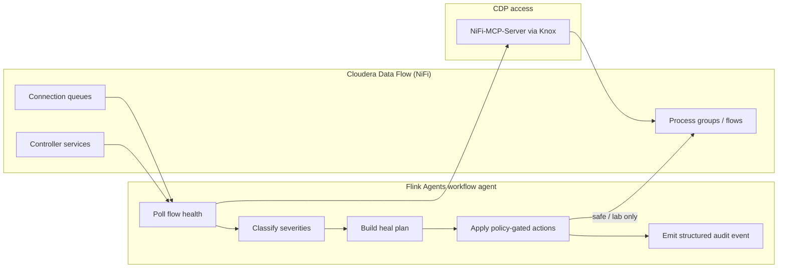

# Flink Agents and Cloudera Data Flow (CDF)

A brief explanation of how [Apache Flink Agents](https://github.com/apache/flink-agents) can monitor and heal **Cloudera Data Flow (CDF)** NiFi flows — and why that is a different (and often better) layer than built-in NiFi retry logic.

CDF runs managed Apache NiFi on CDP. The patterns below are implemented in this repo as `workflow_nifi_monitor` (local REST) and via [NiFi-MCP-Server](https://github.com/cloudera/NiFi-MCP-Server) on CDP (Knox). See [NIFI_MONITOR.md](NIFI_MONITOR.md) for the full lab guide.

---

## How Flink Agents work with CDF flows

Flink Agents do **not** replace NiFi processors inside a flow. They run as a **separate control plane** that observes CDF from the outside and, when policy allows, applies targeted remediations.

**Typical cycle**

1. **Trigger** — A timer, Kafka tick, or Flink job invokes the workflow agent on a schedule (e.g. every 10–60 seconds) or on demand.
2. **Observe** — The agent calls NiFi management APIs (CDF: via NiFi-MCP) to snapshot flow health for a process group or the root canvas.
3. **Classify** — Findings are mapped to severities: stopped processors, invalid configuration, disabled controller services, queue backpressure, error bulletins, API slowness/unreachability.
4. **Decide** — A deterministic policy graph (`@action` / `@tool`) builds an ordered heal plan. No LLM is required for mutations.
5. **Act (optional)** — Only in explicit phases (`safe`, `lab`) and behind gates: dry-run, allowlists, cooldowns, max mutations, verify-after.
6. **Record** — Every poll emits a structured `OutputEvent` (health score, severities, heal actions taken/skipped) for dashboards, Kafka topics, or downstream runbooks.

On CDP, the same tool names used locally (`get_flow_health_status`, `start_processor`, `enable_controller_service`, etc.) are exposed through **NiFi-MCP-Server**, so heal policies port from lab to production without rewriting flow logic.

---

## How flows are monitored

Monitoring is **flow-wide and stateful**, not limited to a single processor’s retry loop.

| Signal | What it tells you |
|--------|-------------------|
| **Processor state** | STOPPED, RUNNING, or INVALID — a flow can look “fine” in the UI while a critical processor is stopped |
| **Validation status** | INVALID processors (e.g. missing relationships, bad properties) will never succeed on retry |
| **Controller services** | DISABLED Kafka/SSL/record services block entire subtrees |
| **Queue depth / backpressure** | Connections backing up — graded warn/crit thresholds, not just binary “full” |
| **Bulletins** | ERROR/WARNING history — repeated failures on the same component |
| **API probe** | NiFi unreachable or slow — distinguishes “flow problem” from “platform problem” |

The agent computes a **health score** and severity set from these signals, then compares against the previous poll to detect **deltas** (new failures, worsening queues). That supports continuous mode (`ratatoskr monitor start --interval 10`) or cluster-deployed Flink jobs that poll until stopped.

**Phased behavior** (recommended for CDF):

| Phase | Purpose |
|-------|---------|
| **monitor** | Observe and alert only — no canvas changes |
| **safe** | Low-risk fixes: start stopped processors, enable disabled controller services |
| **lab** | Controlled fixes: templated config repair, stop upstream on backpressure, restart on repeated bulletins, optional queue drain (explicitly gated) |

This matches how operators actually run production: watch first, automate only what is proven safe.

---

## Why this is better than “NiFi retry a couple of times on blockage”

NiFi’s **Retry** relationship and **penalize / yield** settings are useful **inside** a processor for transient errors (network blip, downstream timeout). They are not a substitute for **flow-level operations monitoring**.

| Dimension | NiFi retry on blockage | Flink Agents flow monitor |
|-----------|------------------------|---------------------------|
| **Scope** | One processor, one relationship | Entire process group (or root) — all processors, queues, services |
| **Root cause** | Retries the same failing step | Detects *why* it failed: stopped upstream, invalid config, disabled CS, topic missing |
| **INVALID / STOPPED** | Retry does not fix a stopped or misconfigured processor | Explicit classification + targeted start / config fix / terminate |
| **Backpressure** | Retries can **add load** to an already saturated queue | Detects backpressure, can stop upstream or drain (lab, allowlisted) instead of hammering retry |
| **Cross-component** | No visibility into Kafka lag + NiFi queue together | Can correlate NiFi backpressure with Kafka consumer lag and heal in order (topic → start consumer) |
| **Audit** | Processor logs only | Structured events: poll id, severities, actions, skipped reasons, verify result |
| **Safety** | Retries are always “on” once configured | Phased gates: monitor-only default, dry-run, allowlists, cooldown, max mutations per cycle |
| **Human loop** | Operator discovers failure in UI | Optional ReAct runbook explains findings; HITL approve before heal |

**Concrete example — queue blockage**

A downstream processor is slow. NiFi queues fill; upstream processors hit backpressure. **Retry** on the slow processor may re-attempt the same work, increasing duplicates or load, while the real issue is a **STOPPED ConsumeKafka** processor or a **DISABLED** Kafka controller service three hops away.

A Flink Agents monitor sees: `BACKPRESSURE_CRIT` on connection X, `STOPPED` on ConsumeKafka, health score drop. In **safe** phase it starts the consumer; in **lab** it may stop an upstream generator, empty a allowlisted queue, then restart — with verification and an audit trail.

**When NiFi retry is still right**

Use retry for **transient, in-flight** failures on a single step (HTTP 503, temporary lock). Use Flink Agents for **operational health** of the flow as a system: configuration drift, component lifecycle, backpressure, and coordinated recovery across NiFi and Kafka.

---

## Additional details worth knowing

### Deterministic workflow agents vs ReAct

- **Workflow agents** (`workflow_nifi_monitor`) perform polls and heals — same input → same policy → same allowed actions. Suitable for automation and compliance.
- **ReAct runbooks** (`react_nifi_runbook`) explain monitor output (diagnosis → remediation → verify) and **never mutate** NiFi. Useful for operator chat and HITL: propose on `nifi.runbook.propose`, approve on `nifi.runbook.ack`, then let the workflow agent execute.

Inference explains; the workflow agent heals.

### Kafka + CDF together

Many CDF flows source or sink Kafka. A NiFi-only retry cannot see **missing topics**, **consumer lag**, or **empty consumer groups**. This repo pairs `workflow_kafka_monitor` with `workflow_nifi_monitor` and `workflow_signal_correlate` to match rules like “NiFi backpressure + Kafka lag” or “topic missing + stopped ConsumeKafka” before applying ordered cross-stack heals. See [SIGNAL_CORRELATE.md](SIGNAL_CORRELATE.md).

### Deployment options

| Mode | Fit |
|------|-----|
| **Local / edge poll** | Agent runs on a schedule from a host or sidecar; good for POC and small clusters |
| **Flink cluster job** | Continuous monitor as a Flink Agents job — visible in Flink UI, scales with your streaming platform |
| **Kafka-triggered** | Publish ticks to `nifi.monitor.poll`; agent runs on event-driven cadence |
| **CDP / CDF** | NiFi-MCP-Server + Knox token; enable MCP in dashboard Settings; same policy code as the Docker lab |

### Operational guardrails (production-minded)

- Default **`NIFI_HEAL_PHASE=monitor`** — alerts without touching flows
- **`NIFI_HEAL_DRY_RUN=1`** — plan actions without executing
- **Allowlists** — `NIFI_HEAL_ALLOW_IDS`, `NIFI_HEAL_ALLOW_NAME_REGEX` limit blast radius
- **Cooldown / max mutations** — prevent heal storms
- **Verify after heal** — re-poll to confirm processor RUNNING and queue draining

Emptying queues drops flowfiles permanently — keep that in **lab** only with explicit opt-in.

---

## Summary

**Flink Agents + CDF** = an external, policy-driven **SRE layer** for NiFi flows: continuous health observation, severity classification, gated remediation, and auditable events — complementary to per-processor retry, not a replacement for normal NiFi error handling.

For hands-on steps in this repo: [nifi/README.md](../nifi/README.md) · [NIFI_MONITOR.md](NIFI_MONITOR.md) · [NiFi-MCP-Server](https://github.com/cloudera/NiFi-MCP-Server).
