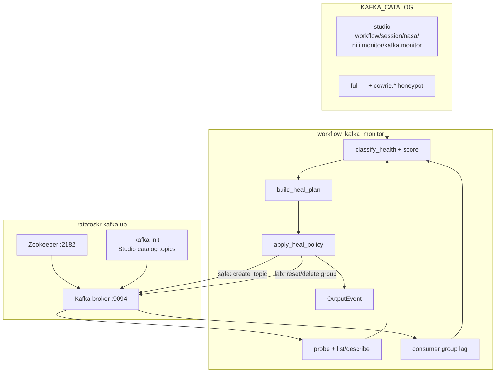
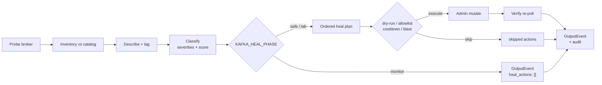
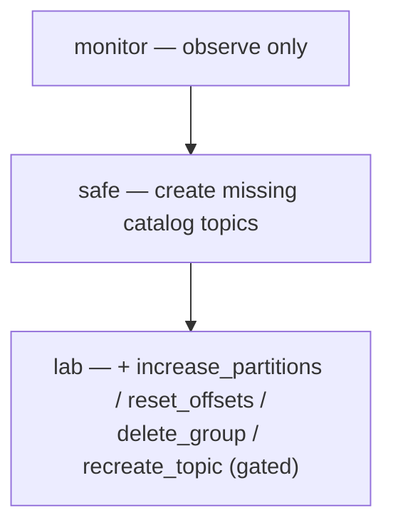

# Kafka Cluster Monitoring with Flink Agents

Deterministic **workflow agent** for Apache Kafka health monitoring and phased auto-healing in Ratatoskr (same pattern as [NiFi](NIFI_MONITOR.md)).

## Architecture



### Monitor → heal cycle



### Heal phases



## Components

| Piece | Role |
|-------|------|
| `ratatoskr kafka up` | Studio Kafka (`deploy/docker-compose.kafka.yml`) |
| `ratatoskr.kafka.KafkaClient` | Admin client (probe, describe, lag, create/delete topic) |
| `ratatoskr.kafka.policy` | Classify severities; apply heal by phase |
| `workflow_kafka_monitor` | Flink Agents workflow agent |

## Severities

| Severity | Meaning |
|----------|---------|
| `BROKER_UNREACHABLE` / `BROKER_SLOW` | Bootstrap / metadata probe |
| `TOPIC_MISSING` | Canonical catalog topic absent on broker |
| `TOPIC_PARTITIONS_LOW` / `TOPIC_PARTITIONS_HIGH` | Live partition count vs catalog |
| `TOPIC_UNEXPECTED` | Extra live topic (opt-in via `KAFKA_FLAG_UNEXPECTED=1`) |
| `UNDER_REPLICATED` / `OFFLINE_PARTITION` | ISR / leader issues |
| `LAG_WARN` / `LAG_CRIT` | Consumer group lag vs `KAFKA_LAG_*` |
| `CONSUMER_STALLED` / `GROUP_EMPTY` | Members=0 while lag > 0 |

## Heal matrix

| Phase | Env | Mutations |
|-------|-----|-----------|
| monitor | `KAFKA_HEAL_PHASE=monitor` | none |
| safe | `KAFKA_HEAL_PHASE=safe` | `create_topic` for missing catalog topics |
| lab | `KAFKA_HEAL_PHASE=lab` | safe + `increase_partitions` (catalog undersized) + `reset_offsets` / `delete_group` if `KAFKA_HEAL_ALLOW_GROUPS` or `KAFKA_HEAL_ALLOW_GROUP_PREFIXES`; `recreate_topic` for oversized if `KAFKA_HEAL_ALLOW_RECREATE=1` |

Gates: `KAFKA_HEAL_DRY_RUN`, `KAFKA_HEAL_MAX_MUTATIONS`, `KAFKA_HEAL_COOLDOWN_SEC`, `KAFKA_HEAL_ALLOW_TOPICS`, `KAFKA_HEAL_VERIFY`, `KAFKA_HEAL_ALLOW_INCREASE_PARTITIONS` (default on), `KAFKA_HEAL_OFFSET_STRATEGY=latest|earliest` (default latest).

Lab `reset_offsets` defaults to **latest** (skips backlog). Set `KAFKA_HEAL_OFFSET_STRATEGY=earliest` to replay.

## Run locally

```bash
ratatoskr kafka up
export KAFKA_HEAL_PHASE=monitor
# Default KAFKA_CATALOG=studio — expects Studio topics only (not cowrie.*)
python examples/agents/run_workflow_kafka_monitor_local.py
# or: ratatoskr agent run workflow_kafka_monitor --local

export KAFKA_HEAL_PHASE=safe KAFKA_HEAL_DRY_RUN=1
python examples/agents/run_workflow_kafka_monitor_local.py
```

Honeypot / full-stack catalog: `export KAFKA_CATALOG=full`

## Heal demo script (safe / lab)

Prereqs: `ratatoskr kafka up`, `source .venv/bin/activate`.
Use `--restore` between scenarios to recreate missing catalog topics.

**Safe — create missing topic**

```bash
python3 scripts/kafka_fault_inject.py --restore
python3 scripts/kafka_fault_inject.py --delete-topic
# optional dry-run first:
export KAFKA_HEAL_PHASE=safe KAFKA_HEAL_DRY_RUN=1
python3 examples/agents/run_workflow_kafka_monitor_local.py --count 1
# live create:
export KAFKA_HEAL_PHASE=safe KAFKA_HEAL_DRY_RUN=0
python3 examples/agents/run_workflow_kafka_monitor_local.py --count 1
# Expect heal_actions: create_topic on kafka.monitor.poll (verified)
```

**Lab — reset / delete allowlisted group**

```bash
python3 scripts/kafka_fault_inject.py --restore
python3 scripts/kafka_fault_inject.py --lab-demo --messages 50
export KAFKA_HEAL_PHASE=lab
export KAFKA_HEAL_ALLOW_GROUPS=ratatoskr-kafka-fault-lab
# Lower thresholds so 50 msgs trip LAG_CRIT in demos:
export KAFKA_LAG_WARN=10 KAFKA_LAG_CRIT=20
python3 examples/agents/run_workflow_kafka_monitor_local.py --count 1
# Expect reset_offsets and/or delete_group only for the allowlisted group
```

Without `KAFKA_HEAL_ALLOW_GROUPS` (or `KAFKA_HEAL_ALLOW_GROUP_PREFIXES`), lab group ops are skipped (`skipped: allowlist`).

**Lab — undersized partitions**

```bash
python3 scripts/kafka_fault_inject.py --undersize-topic nifi.kafka.demo
export KAFKA_HEAL_PHASE=lab
export KAFKA_TOPIC_PARTITIONS=3
export KAFKA_HEAL_ALLOW_TOPICS=nifi.kafka.demo
python3 examples/agents/run_workflow_kafka_monitor_local.py --count 1
# Expect increase_partitions on nifi.kafka.demo
```

Continuous: `python examples/agents/run_workflow_kafka_monitor_local.py --interval 10 --count 6`

## Orchestrated heal examples (shared base)

Shared catalog with NiFi (requires `./scripts/nifi_load_kafka_flow.sh`):

```bash
python3 scripts/demo_nifi_kafka_heal.py --list
python3 scripts/demo_nifi_kafka_heal.py --scenario delete-topic
python3 scripts/demo_nifi_kafka_heal.py --scenario increase-partitions
python3 scripts/demo_nifi_kafka_heal.py --scenario lag-group
python3 scripts/demo_nifi_kafka_heal.py --scenario lag-earliest
python3 scripts/demo_nifi_kafka_heal.py --scenario cross-topic   # Kafka create + NiFi start
python3 scripts/demo_nifi_kafka_heal.py --scenario cross-lag     # NiFi queue relief under lag
```

| Scenario | Phase | Expected ops |
|----------|-------|--------------|
| `delete-topic` | safe | `create_topic` (stop ConsumeKafka first to avoid auto-create) |
| `increase-partitions` | lab | `increase_partitions` |
| `lag-group` | lab | `delete_group` and/or `reset_offsets` |
| `lag-earliest` | lab | `reset_offsets` with `KAFKA_HEAL_OFFSET_STRATEGY=earliest` |
| `cross-topic` / `cross-lag` | lab | Coordinated playbooks — [SIGNAL_CORRELATE.md](SIGNAL_CORRELATE.md) |

Full NiFi-side scenarios: [NIFI_MONITOR.md](NIFI_MONITOR.md#orchestrated-heal-examples).

## Cluster

Requires image with `ratatoskr/kafka` + `kafka-python` (`ratatoskr build`). Studio Kafka must be reachable as `host.docker.internal:9094`.

```bash
export KAFKA_HEAL_PHASE=monitor KAFKA_MONITOR_POLLS=5
ratatoskr agent run workflow_kafka_monitor --cluster
```

Topics: `kafka.monitor.poll` / `kafka.monitor.output` (Studio kafka-init + `kafka_sources`).

Studio compose: [`deploy/docker-compose.kafka.yml`](../deploy/docker-compose.kafka.yml). Cross-signal with NiFi: [SIGNAL_CORRELATE.md](SIGNAL_CORRELATE.md).
