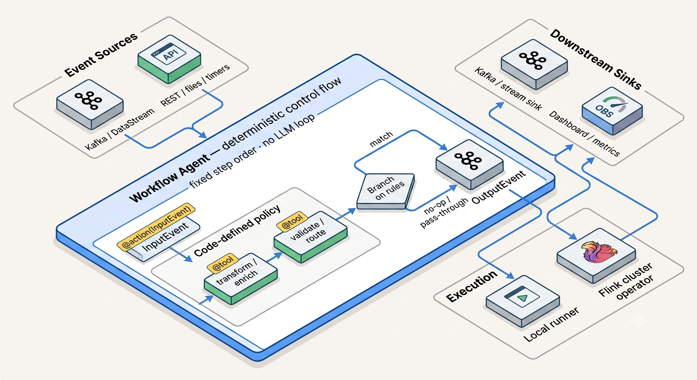
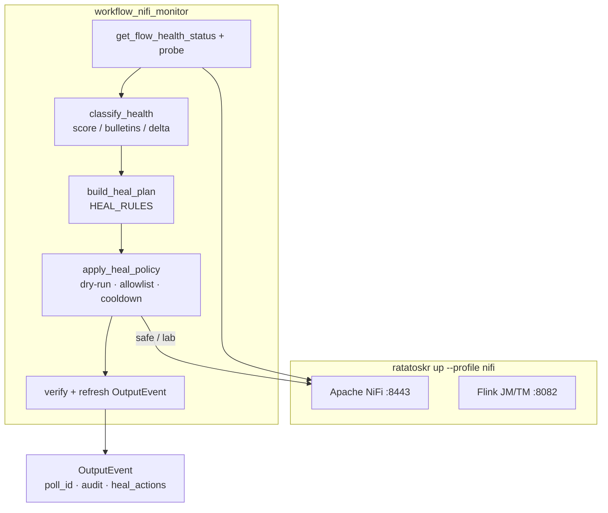

# NiFi Flow Monitoring with Flink Agents

This guide describes the **workflow agent** pattern for Apache NiFi health monitoring and phased auto-healing in Ratatoskr. It does not cover the honeypot stack.

## Why a workflow agent

NiFi heal actions should be **deterministic and auditable**: same health snapshot → same classification → same allowed mutations. That matches the [workflow agent](FLINK_AGENTS.md#workflow-agents) model (code-defined `@action` / `@tool` graph, no LLM in the loop).



## Architecture



Lab quickstart and extra diagrams: [nifi/README.md](../nifi/README.md#architecture). Cross-stack: [SIGNAL_CORRELATE.md](SIGNAL_CORRELATE.md).

## Components

| Piece | Role |
|-------|------|
| `ratatoskr up --profile nifi` | Flink (`deploy/`) + NiFi (`nifi/`) |
| `ratatoskr.nifi.NiFiClient` | Local REST client (MCP-aligned tool names) |
| `ratatoskr.nifi.policy` | Classify severities; apply heal by phase |
| `workflow_nifi_monitor` | Flink Agents workflow agent |
| `react_nifi_runbook` | ReAct explain-only runbook from monitor facts (Cloudera Inference or fallback) |
| [NiFi-MCP-Server](https://github.com/cloudera/NiFi-MCP-Server) | CDP dual path via Knox (Designer / Claude) |

## Severities

| Severity | Meaning |
|----------|---------|
| `STOPPED` | Processor in STOPPED state |
| `INVALID` | Processor validationStatus INVALID |
| `DISABLED_SERVICE` | Controller service DISABLED |
| `BACKPRESSURE` / `_WARN` / `_CRIT` | Queued flowfiles (graded by `NIFI_BP_WARN` / `NIFI_BP_CRIT`) |
| `BULLETIN_ERROR` | ERROR/WARNING bulletins on the board |
| `NIFI_SLOW` / `NIFI_UNREACHABLE` | API probe latency or connect failure |

## Heal matrix

| Phase | Env | Mutations |
|-------|-----|-----------|
| monitor (1A) | `NIFI_HEAL_PHASE=monitor` | none |
| safe (1B) | `NIFI_HEAL_PHASE=safe` | `enable_controller_service`, `start_processor` (ordered) |
| lab (1C) | `NIFI_HEAL_PHASE=lab` | safe + `fix_processor_config` (allowlisted templates, e.g. LogAttribute auto-terminate) + `stop_processor` (upstream of backpressure) + `restart_processor` (repeated bulletins) + `terminate_processor` (INVALID without template); `empty_connection_queue` if `NIFI_HEAL_ALLOW_EMPTY_QUEUE=1` |

Gates: `NIFI_HEAL_DRY_RUN`, `NIFI_HEAL_MAX_MUTATIONS`, `NIFI_HEAL_COOLDOWN_SEC`, `NIFI_HEAL_ALLOW_IDS` / `NIFI_HEAL_ALLOW_NAME_REGEX`, `NIFI_HEAL_VERIFY`, `NIFI_HEAL_ALLOW_CONFIG_FIX` (default on), `NIFI_HEAL_ALLOW_RESTART` (default on), `NIFI_HEAL_RESTART_MIN_BULLETINS` (default 2).

## Run locally

```bash
ratatoskr up --profile nifi
./scripts/nifi_load_sample_flow.sh
export NIFI_HEAL_PHASE=monitor
ratatoskr agent run workflow_nifi_monitor --local
```

### Structured runbook (ReAct, never mutates)

After a monitor poll (or from a fixture), `react_nifi_runbook` turns facts into diagnosis → remediation → verify. Mutations stay on `workflow_nifi_monitor` heal phases.

```bash
# Offline (fixture → fallback or LLM if Designer settings configured)
python examples/agents/run_react_nifi_runbook_local.py
python examples/agents/run_react_nifi_runbook_local.py --fixture invalid-log

# Live: poll NiFi then build runbook
export NIFI_HEAL_PHASE=monitor
python examples/agents/run_react_nifi_runbook_local.py --live
# or: ratatoskr agent run react_nifi_runbook --local
```

Inject a stopped processor, then heal:

```bash
python3 scripts/nifi_fault_inject.py --stop-generate
export NIFI_HEAL_PHASE=safe
python3 examples/agents/run_workflow_nifi_monitor_local.py
```

## Kafka→NiFi demo flow (shared base)

For combined NiFi + Kafka monitoring demos, load a ConsumeKafka pipeline (topic `nifi.kafka.demo`, group `ratatoskr-nifi-kafka-demo`):

```bash
ratatoskr kafka up
ratatoskr up --profile nifi
./scripts/nifi_load_kafka_flow.sh
```

Publish a test message from the host (`localhost:9094`):

```bash
python3 -c "from kafka import KafkaProducer; p=KafkaProducer(bootstrap_servers='localhost:9094'); p.send('nifi.kafka.demo', b'{\"hello\":\"nifi\"}'); p.flush()"
```

### Orchestrated heal examples

Catalog script: `scripts/demo_nifi_kafka_heal.py` — break → monitor → heal on the shared flow/topic.

```bash
python3 scripts/demo_nifi_kafka_heal.py --list
python3 scripts/demo_nifi_kafka_heal.py --scenario <name>
python3 scripts/demo_nifi_kafka_heal.py --all            # every scenario
python3 scripts/demo_nifi_kafka_heal.py --dry-run --scenario stop-consume
```

| Scenario | Stack | Phase | Fault → expected heal |
|----------|-------|-------|------------------------|
| `stop-consume` | NiFi | safe | STOPPED ConsumeKafka → `start_processor` |
| `disable-cs` | NiFi | safe | DISABLED Studio Kafka CS → `enable_controller_service` |
| `invalid-log` | NiFi | lab | INVALID LogAttribute → `fix_processor_config` |
| `queue-backlog` | NiFi | lab | Queued update-to-log → `empty_connection_queue` + starts |
| `delete-topic` | Kafka | safe | TOPIC_MISSING → `create_topic` (+ NiFi restart after) |
| `increase-partitions` | Kafka | lab | TOPIC_PARTITIONS_LOW → `increase_partitions` |
| `lag-group` | Kafka | lab | Empty lagging group → `delete_group` / `reset_offsets` |
| `lag-earliest` | Kafka | lab | LAG_CRIT → `reset_offsets` (`earliest`) |
| `cross-topic` | Cross | lab | TOPIC_MISSING + STOPPED → create topic then start ConsumeKafka |
| `cross-lag` | Cross | lab | BACKPRESSURE + LAG → NiFi queue relief playbook |

Cross-stack details: [SIGNAL_CORRELATE.md](SIGNAL_CORRELATE.md). Kafka-only fault inject: [KAFKA_MONITOR.md](KAFKA_MONITOR.md#heal-demo-script-safe--lab).

Manual stop-consume (without the catalog script):

```bash
python3 scripts/nifi_fault_inject.py --target kafka --stop-consume
export NIFI_HEAL_PHASE=monitor
python3 examples/agents/run_workflow_nifi_monitor_local.py --count 1
# Expect STOPPED ConsumeKafka, heal_actions: []

export NIFI_HEAL_PHASE=safe
python3 examples/agents/run_workflow_nifi_monitor_local.py --count 1
# Expect start_processor on ConsumeKafka
```

## Heal demo script (sample flow — 1B / 1C)

Prereqs: `ratatoskr up --profile nifi`, `./scripts/nifi_load_sample_flow.sh`, and `source .venv/bin/activate`.
Use `--restore` between scenarios to reset the sample flow.

**1B — safe start (STOPPED GenerateFlowFile)**

```bash
python3 scripts/nifi_fault_inject.py --restore
python3 scripts/nifi_fault_inject.py --stop-generate
export NIFI_HEAL_PHASE=safe
python3 examples/agents/run_workflow_nifi_monitor_local.py --count 1
# Expect heal_actions: start_processor on GenerateFlowFile
```

**1C — lab config fix (INVALID LogAttribute)**

```bash
python3 scripts/nifi_fault_inject.py --restore
python3 scripts/nifi_fault_inject.py --invalid-log
# or kafka demo: python3 scripts/nifi_fault_inject.py --target kafka --kafka-invalid-log
export NIFI_HEAL_PHASE=lab
python3 examples/agents/run_workflow_nifi_monitor_local.py --count 1
# Expect heal_actions: fix_processor_config (auto_terminate_success) — not terminate
```

**1C — lab terminate (INVALID without template)**

```bash
# Processor names without a CONFIG_FIX_TEMPLATES match still get terminate_processor
export NIFI_HEAL_PHASE=lab
export NIFI_HEAL_ALLOW_CONFIG_FIX=0   # force terminate path even for LogAttribute
python3 examples/agents/run_workflow_nifi_monitor_local.py --count 1
```

**1C — lab empty queue (BACKPRESSURE)**

```bash
python3 scripts/nifi_fault_inject.py --restore
python3 scripts/nifi_fault_inject.py --queue-backlog --settle-sec 5
export NIFI_HEAL_PHASE=lab
export NIFI_HEAL_ALLOW_EMPTY_QUEUE=1
python3 examples/agents/run_workflow_nifi_monitor_local.py --count 1
# Expect queued update-to-log, then empty_connection_queue (+ start LogAttribute)
```

`--queue-backlog` temporarily sets GenerateFlowFile to `1 sec` so queues build in a few seconds (NiFi’s default is often `1 min`).

Cluster path (after `ratatoskr build`):

```bash
export NIFI_HEAL_PHASE=monitor NIFI_MONITOR_POLLS=5
ratatoskr agent run workflow_nifi_monitor --cluster --profile nifi
```

## CDP / MCP dual path

Local Docker NiFi has no Knox. For CDP Flow Management:

1. Install / configure [NiFi-MCP-Server](https://github.com/cloudera/NiFi-MCP-Server) with `NIFI_API_BASE` and `KNOX_TOKEN`
2. Enable the **Apache NiFi (MCP)** entry under Dashboard Settings → MCP (catalog in `examples/mcp/mcp-server-catalog.yaml`)
3. Keep heal policies written against the same tool names as `ratatoskr.nifi.client`

## Continuous and cluster

**Host continuous mode** (managed):

```bash
# Background NiFi + Kafka polls every 10s (MONITOR_MODE=continuous)
ratatoskr monitor start --interval 10 --phase monitor
ratatoskr monitor status
ratatoskr monitor stop

# Same agents on Flink (visible in UI) — healing via --phase safe|lab
ratatoskr monitor start --cluster --profile nifi --phase safe --interval 10 --no-kafka
ratatoskr monitor status
ratatoskr monitor stop

# Foreground until Ctrl-C
ratatoskr monitor start --foreground --no-kafka --interval 5
```

Or per agent:

```bash
ratatoskr agent run workflow_nifi_monitor --local --continuous --interval 10
ratatoskr agent run workflow_kafka_monitor --local --continuous --interval 10
# same as: python examples/agents/run_workflow_*_monitor_local.py --continuous
```

**Cluster continuous** (unbounded Flink job; in-job interval ticks by default):

```bash
ratatoskr kafka up
# Both NiFi + Kafka as two Flink jobs
python3 scripts/deploy_continuous_monitors.py --phase safe --interval 10
python3 scripts/deploy_continuous_monitors.py --status
python3 scripts/deploy_continuous_monitors.py --stop

# Or NiFi-only via monitor CLI
ratatoskr monitor start --cluster --profile nifi --phase safe --interval 10 --no-kafka
```

Burst (demo-friendly): `NIFI_MONITOR_POLLS=5` / `KAFKA_MONITOR_POLLS=5` (default).  
Continuous: `MONITOR_MODE=continuous` or `*_MONITOR_POLLS=0`.

Also: `--lab-demo` combines INVALID + backlog in one inject.

See [nifi/README.md](../nifi/README.md) for ports, sample flow, and layout.
