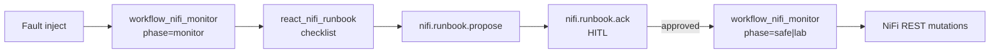
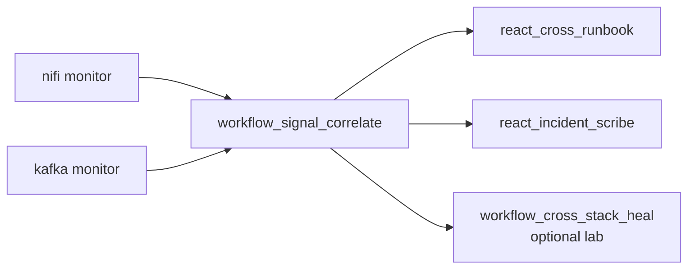

# NiFi runbooks (ReAct, never mutates)

Structured **debug runbooks** for Apache NiFi (and NiFi↔Kafka) incidents. Inference (or deterministic fallback) writes a checklist; **workflow agents** perform mutations only after an explicit heal phase or HITL ack.

Talking point: *The LLM never touches the canvas. The operator (or approval bus) decides. The workflow heals.*

## Which demo when

| Customer story | Script | Guide |
|----------------|--------|-------|
| **Infra heal + HITL** — stopped processor → runbook → approve → start | `scripts/demo_nifi_runbook.py` | this page |
| **Cross-stack checklist** — correlate → structured runbook → optional HITL heal | `scripts/demo_cross_runbook.py` | [SIGNAL_CORRELATE.md](SIGNAL_CORRELATE.md) |
| **Data-plane desired state** — schema/route drift → propose → ack → apply | `scripts/demo_customer_poc.py` | [CUSTOMER_POC.md](CUSTOMER_POC.md) |

Do not mix HITL topics: NiFi heal runbooks use `nifi.runbook.*`; cross-stack uses `signals.cross_runbook.*`; data-plane uses `dataplane.propose` / `dataplane.ack`.

## Agents

| Agent | Input | Mutates? |
|-------|-------|----------|
| `react_nifi_runbook` | `workflow_nifi_monitor` OutputEvent (or fixture) | **No** |
| `react_cross_runbook` | `workflow_signal_correlate` OutputEvent | **No** |
| `workflow_nifi_monitor` | health poll | Only if `NIFI_HEAL_PHASE=safe\|lab` (and HITL approved when using the runbook POC chain) |
| `workflow_cross_stack_heal` | correlated incidents | Only if `CROSS_HEAL_PHASE=lab` |

Manifest: `react_nifi_runbook`, `react_cross_runbook` in [`examples/agents/agent-manifest.yaml`](../examples/agents/agent-manifest.yaml).

## Output contract

Both NiFi and cross runbooks emit the same shape (`ratatoskr.nifi.runbook.schema`, `RUNBOOK_SCHEMA_VERSION=1`):

```text
runbook:
  headline
  situation
  likely_causes[]
  diagnostic_steps[]
  remediation:
    safe_options[]    # e.g. start_processor:GenerateFlowFile
    lab_options[]
    do_not[]
  verify[]
  mode: llm | fallback
```

Agent envelope always has `mutations: []`. Remediation strings are constrained to the allowlisted heal catalog (`op:name`), even when the monitor poll was `phase=monitor` (empty `heal_actions`).

## Architecture





## NiFi runbook POC

Prereqs:

```bash
source .venv/bin/activate
ratatoskr up --profile nifi
./scripts/nifi_load_sample_flow.sh
# Optional LLM: Designer Settings or RATATOSKR_LLM_* / CLOUDERA_*
```

### Offline / live runbook only

```bash
python examples/agents/run_react_nifi_runbook_local.py
python examples/agents/run_react_nifi_runbook_local.py --fixture invalid-log

export NIFI_HEAL_PHASE=monitor
python examples/agents/run_react_nifi_runbook_local.py --live
# or: ratatoskr agent run react_nifi_runbook --local
```

### Full chain: fault → monitor → runbook → HITL → heal

Defaults: **clean** the target flow before inject, **scope** watch/heal to scenario processor names (avoids Data Plane / Replay* noise). Override with `--no-clean` / `--no-scope`.

```bash
python3 scripts/demo_nifi_runbook.py --list
python3 scripts/demo_nifi_runbook.py --offline --scenario stop-generate

# Live + HITL auto-approve + restore
python3 scripts/demo_nifi_runbook.py --scenario stop-generate --heal --approve --restore

# Dry-run heal (plan only after ack)
python3 scripts/demo_nifi_runbook.py --scenario stop-generate --heal --approve --dry-run-heal

# Interactive approve prompt
python3 scripts/demo_nifi_runbook.py --scenario stop-generate --heal

# Reject path
python3 scripts/demo_nifi_runbook.py --scenario stop-generate --heal --reject
```

| Scenario (see `--list`) | Flow | Typical safe/lab options |
|-------------------------|------|---------------------------|
| `stop-generate` | Sample | `start_processor:GenerateFlowFile` |
| `invalid-log` | Sample | lab `fix_processor_config:…` |
| `queue-backlog` | Sample | lab empty queue / start |
| `stop-consume` | Kafka demo | `start_processor:ConsumeKafka` |

### HITL topics

| Topic | Role |
|-------|------|
| `nifi.runbook.brief` | Optional published runbook brief |
| `nifi.runbook.propose` | Heal proposal awaiting approval |
| `nifi.runbook.ack` | Operator approve / reject |

Package: [`ratatoskr/nifi/runbook/`](../ratatoskr/nifi/runbook/) (`hitl.py`, `fallback.py`, fixtures).

## Cross-signal runbook

```bash
python3 scripts/demo_cross_runbook.py
python3 scripts/demo_cross_runbook.py --scenario topic-missing
python3 scripts/demo_cross_runbook.py --scenario topic-missing --heal --approve
python3 scripts/demo_cross_runbook.py --live --inject --heal --approve

python examples/agents/run_react_cross_runbook_local.py
```

Same checklist contract; remediation may reference both NiFi and Kafka ops. HITL topics: `signals.cross_runbook.propose` / `.ack`. Mutations stay on `workflow_cross_stack_heal` after approval — see [SIGNAL_CORRELATE.md](SIGNAL_CORRELATE.md).

## LLM vs fallback

| Config | Behavior |
|--------|----------|
| Designer / `RATATOSKR_LLM_ENDPOINT_URL` + model + key | `mode: llm` (still catalog-constrained) |
| Incomplete / unreachable | `mode: fallback` deterministic text |

Cloudera Inference aliases: `CLOUDERA_*` (same settings surface as other ReAct demos).

## Safety

- Runbook agents **never** call `start_processor` / `empty_connection_queue` / etc.
- Heal still gated by `NIFI_HEAL_PHASE`, dry-run, allowlists, cooldown, max mutations.
- HITL: no ack → no heal in the POC chain.
- Data Plane PG can coexist; prefer `--scope` on runbook demos so heal does not touch Replay*/ValidateJson.

## Related

- [NIFI_MONITOR.md](NIFI_MONITOR.md) — monitor / heal matrix  
- [SIGNAL_CORRELATE.md](SIGNAL_CORRELATE.md) — cross rules + `react_cross_runbook`  
- [CUSTOMER_POC.md](CUSTOMER_POC.md) — data-plane propose/ack/apply (not heal)  
- [DATAPLANE_APPROVAL.md](DATAPLANE_APPROVAL.md) — `dataplane.propose` / `dataplane.ack`  
- [nifi/README.md](../nifi/README.md) — lab quickstart  
