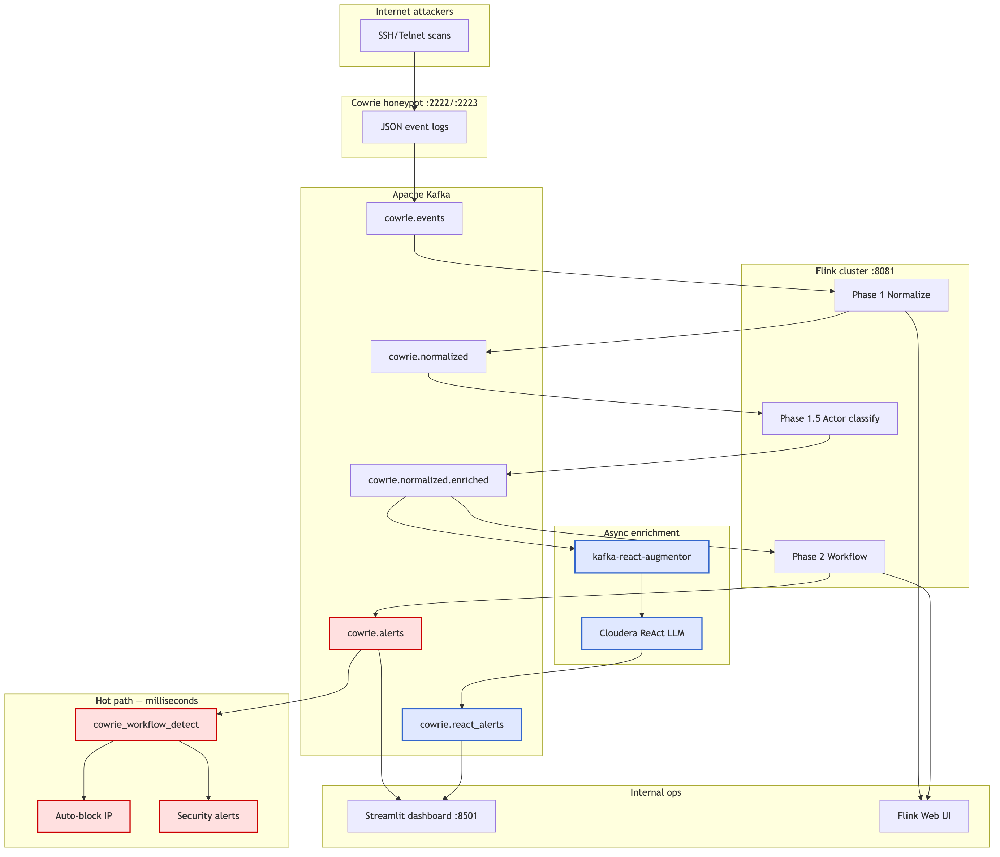
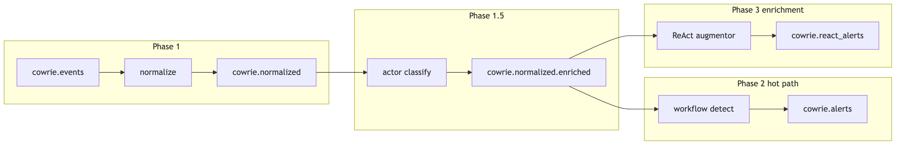
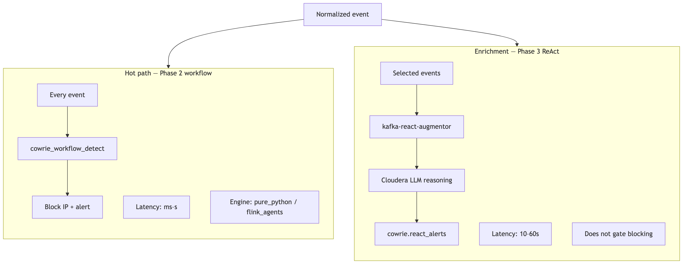

# Documentation

Guides for the Flink Agents CLI workspace. Subproject-specific docs may also live under `honeypot/docs/` as the honeypot bundle grows.

## Getting started

| Doc | Description |
|-----|-------------|
| [../README.md](../README.md) | Workspace overview and quick start |
| [../flink_cowrie/README.md](../flink_cowrie/README.md) | CLI package |
| [../honeypot/README.md](../honeypot/README.md) | Cowrie cybersecurity demo |
| [../examples/README.md](../examples/README.md) | Generic Flink Agents demos |

## Guides in this directory

| Doc | Description |
|-----|-------------|
| [COWRIE_QUICKSTART.md](COWRIE_QUICKSTART.md) | Cowrie honeypot setup and first demo |
| [PRODUCTION_ARCHITECTURE.md](PRODUCTION_ARCHITECTURE.md) | Hot path vs ReAct enrichment, Kafka topics, env vars |

## Architecture diagrams

| Diagram | Preview |
|---------|---------|
| [Reference architecture](../honeypot/README.md#architecture) |  |
| Production topology |  |
| Pipeline phases |  |
| Hot path vs enrichment |  |

PNG sources: `honeypot/docs/images/` (regenerate from `*.mmd` via `scripts/render_architecture_diagrams.sh` when present).

Dashboard screenshots: `honeypot/images/` (see [honeypot/README.md](../honeypot/README.md#screenshots)).

## External links

- [Flink Agents 0.3 documentation](https://nightlies.apache.org/flink/flink-agents-docs-release-0.3/)
- [Apache Flink Agents GitHub](https://github.com/apache/flink-agents)
