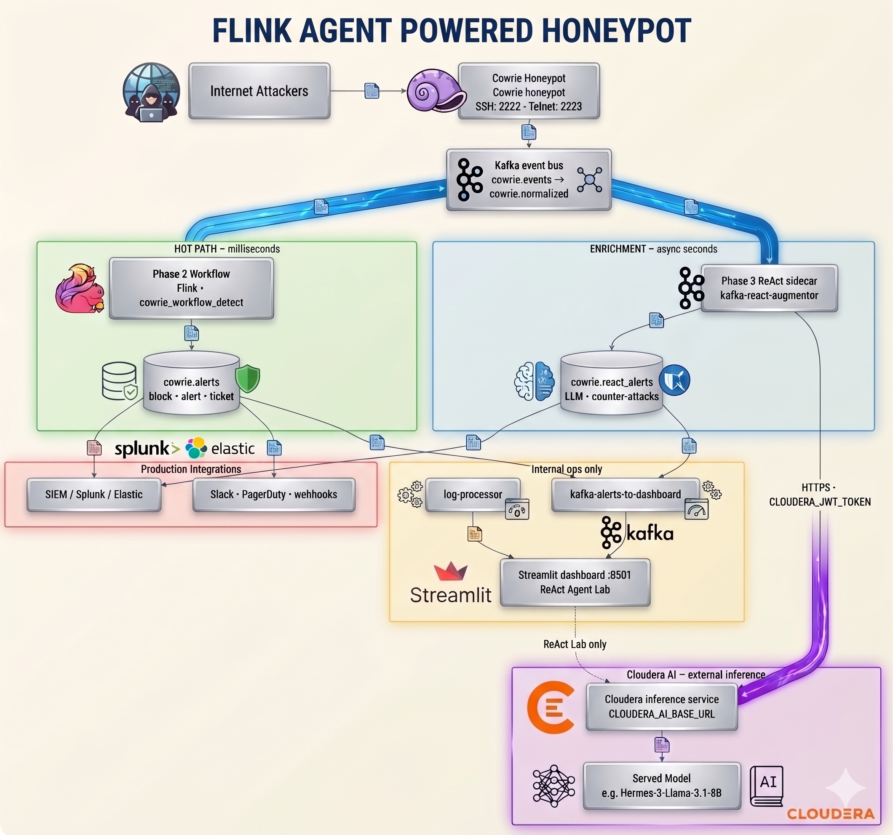
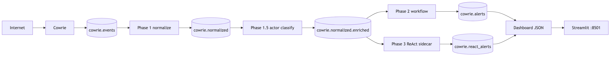

# Documentation

  

Guides for the **Ratatoskr** Flink Agents workspace. Honeypot-specific docs live under [`honeypot/docs/`](../honeypot/docs/). Catalog metadata: [`METADATA.yaml`](../METADATA.yaml).

## Getting started

| Doc | Description |
|-----|-------------|
| [../README.md](../README.md) | Blueprint overview and quick start |
| [PLATFORM.md](PLATFORM.md) | **Control API, agents, observability, Studio cluster, dashboard integration** |
| [../ratatoskr/README.md](../ratatoskr/README.md) | CLI package and commands |
| [../examples/README.md](../examples/README.md) | Example agents and demos |

## Guides in this directory

| Doc | Description |
|-----|-------------|
| [PLATFORM.md](PLATFORM.md) | Platform control plane — API, agent registry, Studio cluster, verify |
| [Blog.md](Blog.md) | Narrative overview and design rationale |
| [FLINK_AGENTS.md](FLINK_AGENTS.md) | Workflow vs ReAct agents — concepts, comparison, diagrams |
| [NIFI_MONITOR.md](NIFI_MONITOR.md) | NiFi flow monitoring / healing + orchestrated demo catalog |
| [NIFI_RUNBOOK.md](NIFI_RUNBOOK.md) | ReAct NiFi / cross runbooks + HITL approve before heal |
| [KAFKA_MONITOR.md](KAFKA_MONITOR.md) | Kafka cluster monitoring / healing + demo scenarios |
| [SIGNAL_CORRELATE.md](SIGNAL_CORRELATE.md) | NiFi↔Kafka correlation, incident scribe, cross-stack heal |
| [SCHEMA_GATE.md](SCHEMA_GATE.md) | Data-plane schema/contract gate (`schema.violations`) |
| [ROUTE_ENRICH.md](ROUTE_ENRICH.md) | Routing / enrichment rule apply (NiFi executes) |
| [REPLAY.md](REPLAY.md) | Lab-gated Kafka↔NiFi replay job (not heal) |
| [DATAPLANE_APPROVAL.md](DATAPLANE_APPROVAL.md) | Desired-state bus: propose → ack → apply |
| [CUSTOMER_POC.md](CUSTOMER_POC.md) | 10–15 min scripted customer demo path |
| [AGENT_DESIGNER_PLAN.md](AGENT_DESIGNER_PLAN.md) | Agent Designer — visual agent authoring, codegen, roadmap |
| [../assets/branding/RATATOSKR.md](../assets/branding/RATATOSKR.md) | Name, mythology, icon and title banner assets |
| [../dashboard/README.md](../dashboard/README.md) | Dashboard — pages, dev setup, project structure |

## Optional NiFi (`nifi/`)

| Doc | Description |
|-----|-------------|
| [../nifi/README.md](../nifi/README.md) | NiFi lab quickstart, heal phases, sample + Kafka demo heals |
| [NIFI_MONITOR.md](NIFI_MONITOR.md) | Workflow agent + MCP dual-path guide |
| [NIFI_RUNBOOK.md](NIFI_RUNBOOK.md) | ReAct runbooks + HITL propose/ack before heal |
| [CUSTOMER_POC.md](CUSTOMER_POC.md) | Data-plane customer demo path |
| [SIGNAL_CORRELATE.md](SIGNAL_CORRELATE.md) | Cross-stack heals on Kafka→NiFi demo |
| [NiFi-MCP-Server](https://github.com/cloudera/NiFi-MCP-Server) | CDP Knox MCP upstream |

## Optional Kafka monitoring

Studio Kafka (`ratatoskr kafka up`) is independent of the honeypot broker.

| Doc | Description |
|-----|-------------|
| [KAFKA_MONITOR.md](KAFKA_MONITOR.md) | Monitor / heal + Mermaid architecture |
| [SIGNAL_CORRELATE.md](SIGNAL_CORRELATE.md) | Cross-signal with NiFi |
| [../deploy/docker-compose.kafka.yml](../deploy/docker-compose.kafka.yml) | Compose stack |

## Optional honeypot (`honeypot/docs/`)

| Doc | Description |
|-----|-------------|
| [../honeypot/README.md](../honeypot/README.md) | Cowrie honeypot demo |
| [COWRIE_QUICKSTART.md](../honeypot/docs/COWRIE_QUICKSTART.md) | Cowrie setup |
| [PRODUCTION_ARCHITECTURE.md](../honeypot/docs/PRODUCTION_ARCHITECTURE.md) | Hot path vs ReAct enrichment |

## Architecture diagrams

### Flink Agents (workflow vs ReAct)

| Diagram | Source |
|---------|--------|
| [Overview stack](FLINK_AGENTS.md#what-flink-agents-adds-to-flink) | `assets/images/flink-agents-overview.mmd` |
| [Workflow agents](FLINK_AGENTS.md#workflow-agents) | `assets/images/WorkflowAgentsDiagram.png` |
| [Workflow sequence](FLINK_AGENTS.md#execution-model) | `assets/images/workflow-agent-flow.mmd` |
| [ReAct agents](FLINK_AGENTS.md#react-agents) | `assets/images/ReactAgentsDiagram.png` |
| [ReAct loop](FLINK_AGENTS.md#execution-model-1) | `assets/images/react-agent-loop.mmd` |
| [Hybrid hot path + enrichment](FLINK_AGENTS.md#recommended-hybrid-pattern) | `assets/images/workflow-vs-react-hybrid.mmd` |

### NiFi / Kafka monitoring (Mermaid in guides)

| Diagram | Doc |
|---------|-----|
| Stack + agent + heal cycle | [../nifi/README.md](../nifi/README.md#architecture) |
| Severities / phases / demos | [NIFI_MONITOR.md](NIFI_MONITOR.md#architecture) |
| Studio broker + catalog + heal | [KAFKA_MONITOR.md](KAFKA_MONITOR.md#architecture) |
| Cross-signal correlate → scribe → heal | [SIGNAL_CORRELATE.md](SIGNAL_CORRELATE.md#architecture) |

### Honeypot (optional)

| Diagram | Preview |
|---------|--------|
| [Reference architecture](../honeypot/README.md) |  |
| Production topology |  |

PNG sources: `assets/images/` and `honeypot/docs/images/` (`scripts/render_architecture_diagrams.sh`).

## External links

- [Flink Agents 0.3 documentation](https://nightlies.apache.org/flink/flink-agents-docs-release-0.3/)
- [Apache Flink Agents GitHub](https://github.com/apache/flink-agents)
- [Cloudera Blueprints Standard](https://github.com/kevinbtalbert/Cloudera-Blueprints-Standard)
