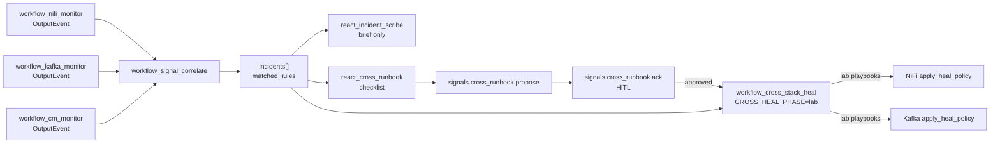
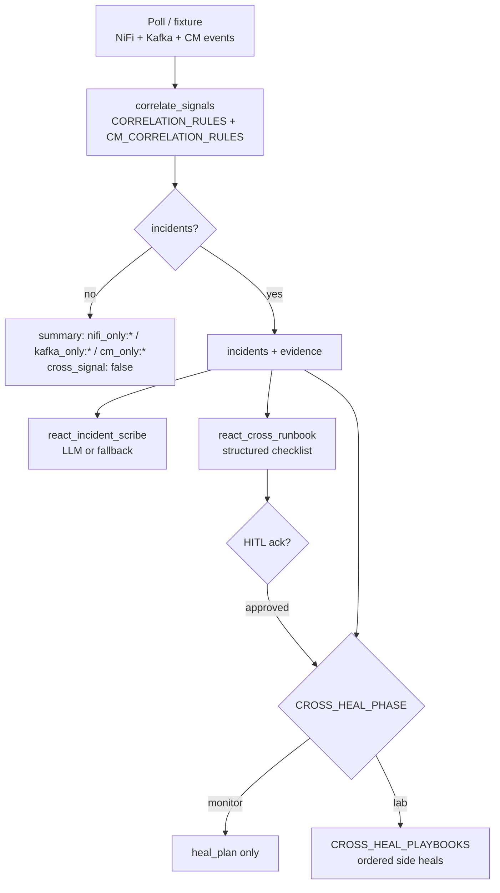
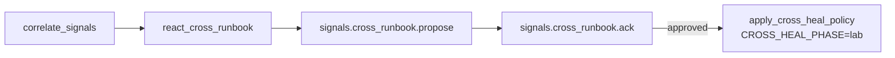

# Cross-signal correlation & cross-stack heal

Pairing of [NiFi](NIFI_MONITOR.md), [Kafka](KAFKA_MONITOR.md), and optional [Cloudera Manager](FLINK_AGENTS_CDF_FLOWS.md) monitor OutputEvents into incidents, optional ReAct brief, and gated coordinated heals on the shared Kafka→NiFi demo flow.

## Architecture



### Correlate → brief / runbook → optional heal



## Agents

| Agent | Type | Role |
|-------|------|------|
| `workflow_signal_correlate` | workflow | Match rules across NiFi + Kafka (+ optional CM) severities → `incidents[]` (observe-only) |
| `workflow_cross_stack_heal` | workflow | Correlate, then run playbooks when `CROSS_HEAL_PHASE=lab` |
| `react_incident_scribe` | react | Explain incidents (Designer LLM or deterministic fallback). **Never mutates.** |
| `react_cross_runbook` | react | Structured diagnosis → remediation → verify checklist from correlation (same shape as NiFi runbook). **Never mutates.** Optional HITL → `workflow_cross_stack_heal`. See [NIFI_RUNBOOK.md](NIFI_RUNBOOK.md). |
| `workflow_cm_monitor` | workflow | CM health poll (recommend-only). Input to correlate. See [CM_MONITOR.md](CM_MONITOR.md). |
| `react_cm_runbook` | react | CM debug runbook from monitor facts. **Never mutates CM.** |

## Rules

### NiFi ↔ Kafka

| Rule id | NiFi | Kafka | Data-plane | Level | Cross heal (lab) |
|---------|------|-------|------------|-------|------------------|
| `pipeline_backpressure_lag` | BACKPRESSURE* | LAG_* / CONSUMER_STALLED | — | HIGH | NiFi queue relief (`stop` / `empty_connection_queue` / `start`) |
| `dual_unreachable` | NIFI_UNREACHABLE | BROKER_UNREACHABLE | — | HIGH | — (infra) |
| `nifi_stopped_kafka_lag` | STOPPED / DISABLED_SERVICE | LAG_* / stalled | — | HIGH | Start ConsumeKafka path (safe) |
| `nifi_invalid_kafka_missing` | INVALID / BULLETIN_ERROR | TOPIC_MISSING | — | MEDIUM | `create_topic` + NiFi lab fix/start |
| `kafka_topic_nifi_consumer` | STOPPED / INVALID / … | TOPIC_MISSING | — | HIGH | `create_topic` → `start_processor` ConsumeKafka |
| `schema_violation_spike` | — | — | SCHEMA_VIOLATIONS | MEDIUM | — (propose schema fix via approval bus) |
| `route_config_drift` | — | — | ROUTE_DRIFT:* | MEDIUM | — (propose route patch via approval bus) |
| `schema_violations_with_lag` | — | LAG_* | SCHEMA_VIOLATIONS | HIGH | — |
| `stack_degraded` | any degradation | any degradation | — | MEDIUM (fallback) | — |

### CM ↔ NiFi / Kafka

Requires **both** CM severities and matching NiFi or Kafka severities. Solo CM faults (e.g. `cm_only:EVENT_CRITICAL`) do **not** create incidents.

| Rule id | CM | NiFi | Kafka | Level |
|---------|-----|------|-------|-------|
| `cm_hdfs_capacity_backpressure` | HDFS_CAPACITY_HIGH / METRIC_BREACH | BACKPRESSURE* | — | HIGH |
| `cm_kafka_broker_down_lag` | ROLE_DOWN / SERVICE_DOWN / KAFKA_UNDER_REPLICATED | — | LAG_* / UNDER_REPLICATED | HIGH |
| `cm_nifi_stopped_backpressure` | ROLE_DOWN / SERVICE_DOWN / SERVICE_BAD | STOPPED / BACKPRESSURE* | — | HIGH |
| `cm_event_impala_nifi_slow` | EVENT_CRITICAL / EVENT_WARN | NIFI_SLOW / BULLETIN_ERROR | — | MEDIUM |
| `cm_impala_event_kafka_lag` | EVENT_CRITICAL | — | LAG_CRIT / stalled | HIGH |
| `cm_unreachable_dual` | CM_UNREACHABLE | NIFI_UNREACHABLE | BROKER_UNREACHABLE | HIGH |
| `cm_stack_degraded` | CM degradation | degradation | degradation | MEDIUM (fallback) |

### CM timeseries metrics

`workflow_cm_monitor` polls CM timeseries for HDFS capacity and Kafka under-replication (when those services exist). Thresholds come from `CM_METRIC_THRESHOLDS` (default `hdfs_capacity_pct: 85`, `kafka_under_replicated_min: 1`). Breaches emit severities like `HDFS_CAPACITY_HIGH` and appear in `health.metrics` / `health.metric_breaches`.

Live correlate polls CM automatically when `CM_API_BASE`, `KNOX_TOKEN`, or `CM_CLUSTER` is set. The local runner loads `.env` (for `CM_API_BASE` / `CM_CLUSTER`); **`KNOX_TOKEN` must still be exported** in your shell. Use `--no-cm` to skip CM on live runs.

```bash
export KNOX_TOKEN='<jwt>'
python examples/agents/run_workflow_signal_correlate_local.py          # live: NiFi + Kafka + CM
python examples/agents/run_workflow_signal_correlate_local.py --demo-cm
python examples/agents/run_workflow_signal_correlate_local.py --no-cm   # NiFi+Kafka only
```

When only one side is unhealthy, correlation emits **no** cross-signal incident; `classification.summary` looks like `nifi_only:NIFI_UNREACHABLE`, `cm_only:CM_SLOW`, or `kafka_only:LAG_CRIT` and `cross_signal: false`.

## Env

| Variable | Default | Meaning |
|----------|---------|---------|
| `CROSS_HEAL_PHASE` | `monitor` | `monitor` = plan only; `lab` = execute playbooks |
| `CROSS_HEAL_DRY_RUN` | off | Propose without mutating |
| `CROSS_HEAL_ALLOW_EMPTY_QUEUE` | off | Allow NiFi `empty_connection_queue` in lag playbook |
| `CROSS_HEAL_DEMO_TOPIC` | `nifi.kafka.demo` | Preferred topic for create_topic steps |
| `CROSS_HEAL_CONSUME_NAMES` | `ConsumeKafka` | Preferred processor names for start steps |

Side gates (`NIFI_HEAL_*`, `KAFKA_HEAL_*`) still apply inside each playbook step.

## Offline fixtures

```bash
# Correlate BACKPRESSURE + LAG_CRIT (no brokers)
python examples/agents/run_workflow_signal_correlate_local.py --demo

# Schema violations + route drift + lag fixtures
python examples/agents/run_workflow_signal_correlate_local.py --demo-dataplane

# CM + NiFi backpressure + Kafka lag (offline)
python examples/agents/run_workflow_signal_correlate_local.py --demo-cm

# Plan cross heals for topic-missing / backpressure-lag fixtures
python examples/agents/run_workflow_cross_stack_heal_local.py --demo topic-missing
python examples/agents/run_workflow_cross_stack_heal_local.py --demo backpressure-lag

# Incident brief (never mutates)
python examples/agents/run_react_incident_scribe_local.py

# Cross-signal runbook (explain-only)
python examples/agents/run_react_cross_runbook_local.py
python3 scripts/demo_cross_runbook.py
python3 scripts/demo_cross_runbook.py --scenario topic-missing

# HITL propose → approve (offline records ack only)
python3 scripts/demo_cross_runbook.py --scenario topic-missing --heal --approve
python3 scripts/demo_cross_runbook.py --scenario topic-missing --heal --reject
```

## HITL → cross-stack heal

Mirror of NiFi runbook Phase 4: ReAct never mutates; operator ack gates `workflow_cross_stack_heal`.



| Topic | Role |
|-------|------|
| `signals.cross_runbook.propose` | Heal proposal awaiting approval |
| `signals.cross_runbook.ack` | Operator approve / reject |

```bash
# Live inject (cross-topic) + HITL + heal
python3 scripts/demo_cross_runbook.py --live --inject --heal --approve

# Dry-run heal after ack
python3 scripts/demo_cross_runbook.py --live --inject --heal --approve --dry-run-heal

# Interactive approve prompt
python3 scripts/demo_cross_runbook.py --live --inject --heal
```

Talking point: *Inference didn’t touch NiFi or Kafka; the operator approved; the cross-stack workflow healed.*

Package: [`ratatoskr/correlation/runbook/`](../ratatoskr/correlation/runbook/) (`hitl.py`, `fallback.py`, context).

## Live heal examples

Prereqs: `ratatoskr kafka up`, `ratatoskr up --profile nifi`, `./scripts/nifi_load_kafka_flow.sh`.

```bash
# Correlate only (live poll both monitors)
python examples/agents/run_workflow_signal_correlate_local.py --live

# Cross-stack agent — plan (default) or heal
python examples/agents/run_workflow_cross_stack_heal_local.py --live --phase monitor
CROSS_HEAL_PHASE=lab CROSS_HEAL_ALLOW_EMPTY_QUEUE=1 \
  python examples/agents/run_workflow_cross_stack_heal_local.py --live --phase lab
```

### Catalog demos (`demo_nifi_kafka_heal.py`)

| Scenario | Inject | Matched rule(s) | Heal ops |
|----------|--------|-----------------|----------|
| `cross-topic` | Stop ConsumeKafka + delete `nifi.kafka.demo` | `kafka_topic_nifi_consumer` | `create_topic` → `start_processor` |
| `cross-lag` | Stop LogAttribute + publish backlog + lag fault group | `pipeline_backpressure_lag`, `nifi_stopped_kafka_lag` | queue relief + start stopped |

```bash
python3 scripts/demo_nifi_kafka_heal.py --scenario cross-topic
python3 scripts/demo_nifi_kafka_heal.py --scenario cross-lag
python3 scripts/demo_nifi_kafka_heal.py --dry-run --scenario cross-topic
```

Single-stack heal examples on the same flow: [NIFI_MONITOR.md](NIFI_MONITOR.md#orchestrated-heal-examples) · [KAFKA_MONITOR.md](KAFKA_MONITOR.md#orchestrated-heal-examples-shared-base).

Runbook checklist shape + NiFi HITL: [NIFI_RUNBOOK.md](NIFI_RUNBOOK.md).

Optional Kafka topics: `signals.correlate.output`, `signals.cross_heal.output`, `signals.incident.brief`, `signals.cross_runbook.propose`, `signals.cross_runbook.ack`.

Tests: `python3 test/test_signal_correlate.py` · `python3 test/test_cross_runbook.py` · `python3 test/test_cm_metrics.py`.

CM monitor guide: [CM_MONITOR.md](CM_MONITOR.md).
