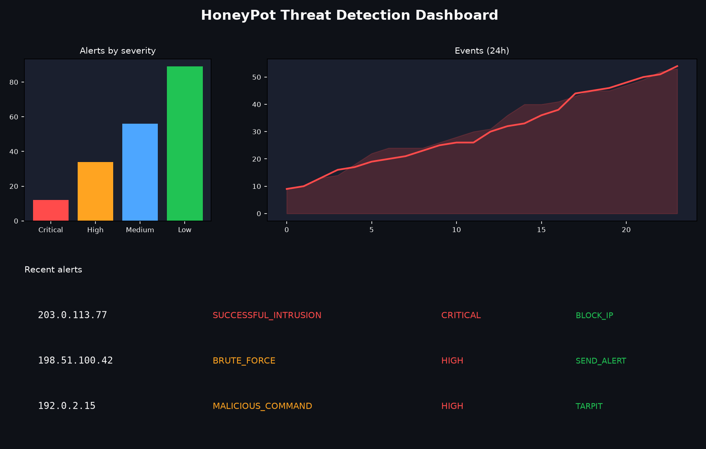
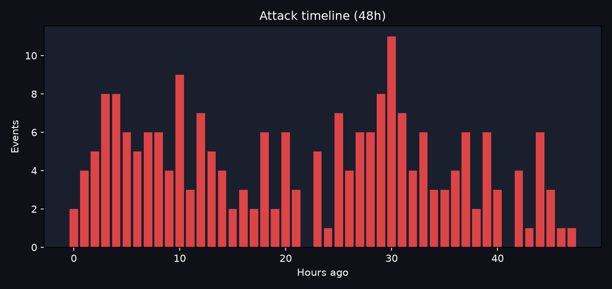
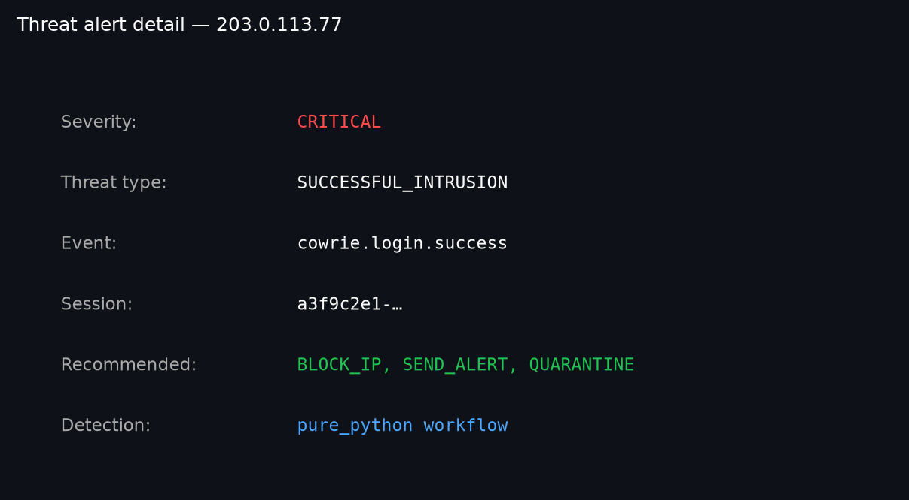
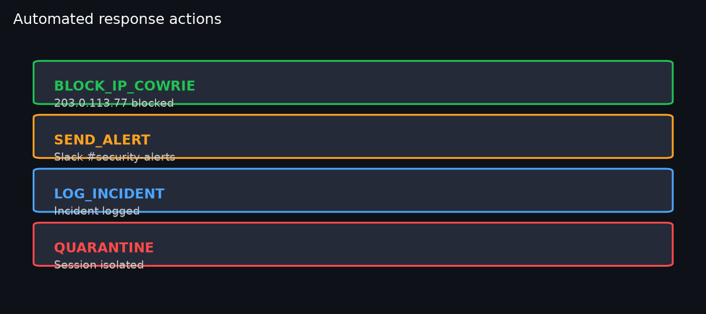
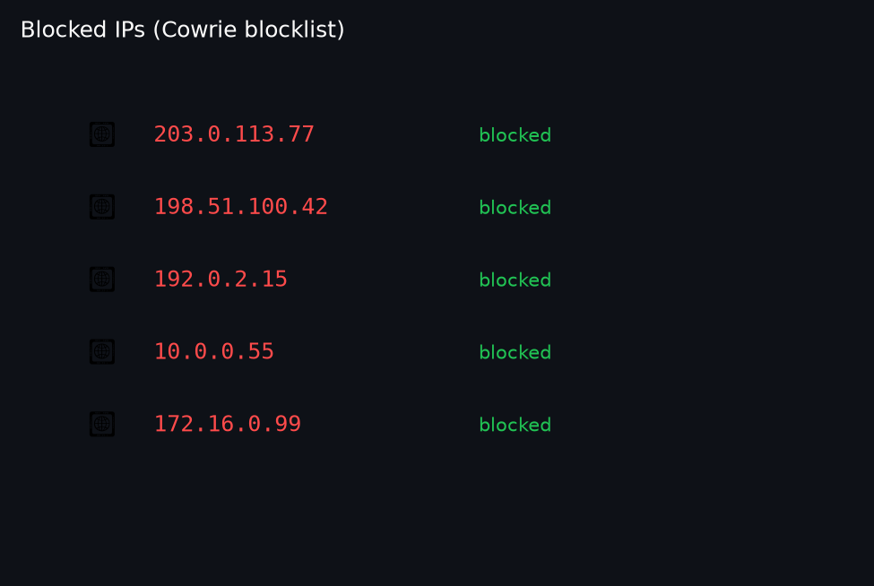
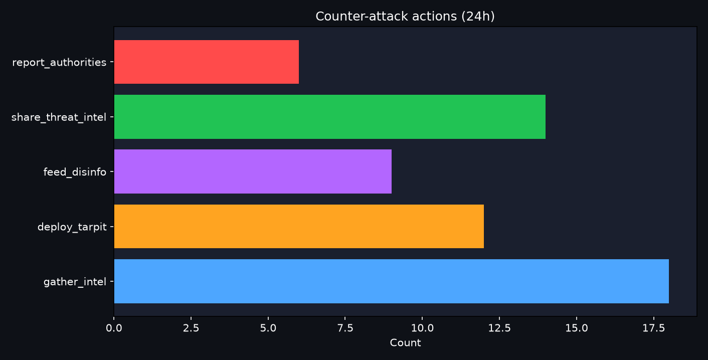
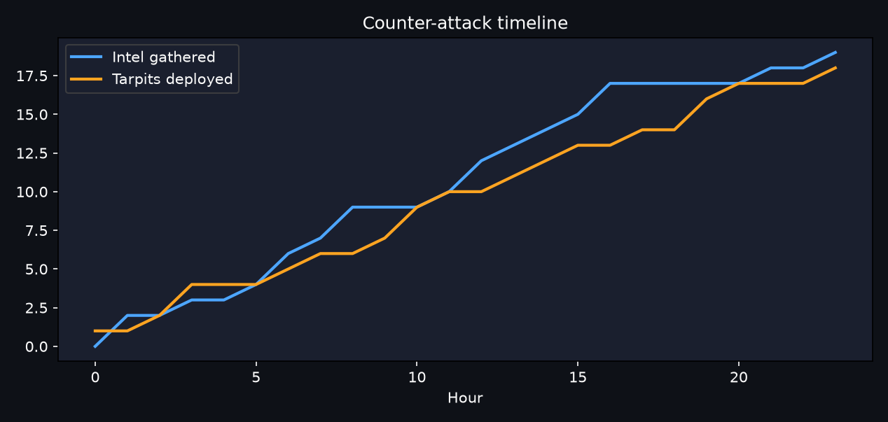

# Cowrie Honeypot — Cybersecurity Demo

**Real-time threat detection and automated response using Apache Flink Agents with [Cowrie](https://github.com/cowrie/cowrie).**

This directory is a **subproject** in the [Flink Agents CLI](../README.md) workspace. It bundles pipeline code, Docker services, dashboards, and tests for a honeypot streaming pipeline.

## Architecture


*Cowrie → Kafka → Phase 2 workflow (`cowrie.alerts`) vs Phase 3 ReAct enrichment (`cowrie.react_alerts`).*


More diagrams: [../docs/PRODUCTION_ARCHITECTURE.md](../docs/PRODUCTION_ARCHITECTURE.md)

## What this demo shows

1. Live SSH/Telnet honeypot (ports 2222/2223)
2. Cowrie logs → Kafka → Flink jobs → alert topics
3. Workflow threat detection on the hot path (`cowrie.alerts`)
4. Optional Cloudera ReAct enrichment (`cowrie.react_alerts`)
5. Streamlit dashboard on port 8501

## Quick start

From the **repository root**:

```bash
pip install -e .
flink-cowrie build
flink-cowrie up --profile full
flink-cowrie dashboard
```

Compose file: `honeypot/docker-compose.yml` when present, otherwise root `docker-compose-cowrie.yml`.

- Dashboard: http://localhost:8501
- Flink UI: http://localhost:8081



## Layout

| Path | Purpose |
|------|---------|
| `src/core/` | Policy, alerts, blocking, counter-attack |
| `src/pipeline/` | Kafka/Flink jobs, Phase 2/3 processors |
| `src/traps/` | Actor classification, prompt-injection traps |
| `src/react/` | ReAct dashboard bridge, executors |
| `src/integrations/` | Cloudera LLM, MCP threat intel |
| `src/cluster/` | PyFlink cluster submit helpers |
| `src/services/` | Kafka → dashboard bridge |
| `demo/` | Cowrie Flink Agents demos |
| `dashboard/` | Streamlit threat UI |
| `simulate_attack/` | Synthetic events + e2e verify |
| `cowrie-data/`, `cowrie-config/` | Honeypot seed data and config |
| `test/` | Honeypot unit and integration tests |

## Pipeline phases

| Phase | Topics | Purpose |
|-------|--------|---------|
| 1 | `cowrie.events` → `cowrie.normalized` | Normalize Cowrie JSON |
| 1.5 | → `cowrie.normalized.enriched` | Actor classification |
| 2 | → `cowrie.alerts` | Workflow detection (hot path) |
| 3 | → `cowrie.react_alerts` | ReAct LLM enrichment |

## CLI commands

```bash
flink-cowrie up --profile full
flink-cowrie test phase1 [--e2e]
flink-cowrie test phase2 [--e2e]
flink-cowrie test actor-classify [--e2e]
flink-cowrie test phase3 [--e2e]
flink-cowrie test production [--e2e]
flink-cowrie utils simulate-attacks --e2e
flink-cowrie verify --tier nightly
```

Phase 3 e2e needs `CLOUDERA_AI_BASE_URL` and `CLOUDERA_JWT_TOKEN` in repo `.env` (then `flink-cowrie sync-env`).

## Screenshots

| | |
|---|---|
| Attack timeline |  |
| Threat alerts |  |
| Response actions |  |
| Blocked IPs |  |
| Counter-attack actions |  |
| Counter-attack timeline |  |

## Environment

```bash
cp .env.example .env          # repo root
flink-cowrie sync-env --recreate
```

## Documentation

- [../docs/COWRIE_QUICKSTART.md](../docs/COWRIE_QUICKSTART.md)
- [../docs/PRODUCTION_ARCHITECTURE.md](../docs/PRODUCTION_ARCHITECTURE.md)
- [test/README.md](test/README.md) — honeypot test guide (when present)

## Parent project

Shared CLI and generic demos: **[../README.md](../README.md)**
