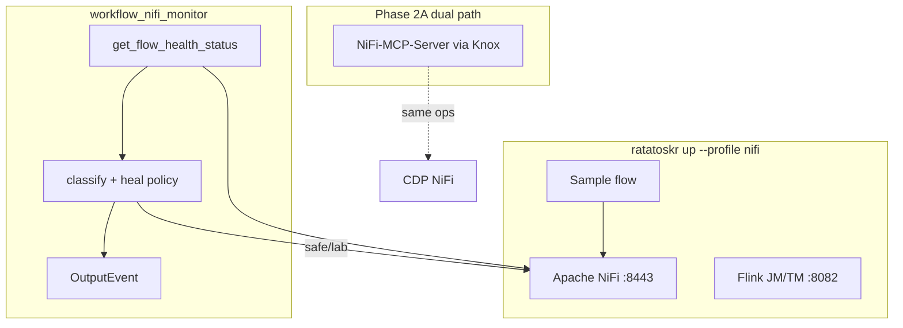

# Apache NiFi — Flow Monitoring and Healing

Optional lab stack for monitoring and healing Apache NiFi flows with a Ratatoskr **workflow agent**. Local demos use the NiFi REST API; CDP deployments can use the same operations via [Cloudera NiFi-MCP-Server](https://github.com/cloudera/NiFi-MCP-Server) (Knox).

## Quickstart

```bash
# From repo root (requires agent_flink_image — ratatoskr build)
source .venv/bin/activate
ratatoskr up --profile nifi

# Wait for NiFi health, then load the sample flow
./scripts/nifi_load_sample_flow.sh

# Monitor only (Phase 1A — default)
export NIFI_HEAL_PHASE=monitor
# Host venv: direct NiFi poll (flink_agents not required).
# Flink image / cluster: uses AgentsExecutionEnvironment when available.
ratatoskr agent run workflow_nifi_monitor --local
# or: python examples/agents/run_workflow_nifi_monitor_local.py
```

| URL | Service |
|-----|---------|
| https://localhost:8443/nifi | NiFi UI (accept the self-signed cert warning) |
| https://localhost:8443/nifi-api | NiFi REST API |
| http://localhost:8082 | Flink Web UI |

## Login credentials (single-user)

This lab NiFi image uses Apache NiFi **single-user mode**. Username and password are **not** generated at runtime — they are set by Docker Compose when the container starts.

| | Default | Source |
|---|---------|--------|
| **Username** | `admin` | `NIFI_USERNAME` → `SINGLE_USER_CREDENTIALS_USERNAME` |
| **Password** | `RatatoskrNiFi1!` | `NIFI_PASSWORD` → `SINGLE_USER_CREDENTIALS_PASSWORD` |

Defined in [`nifi/docker-compose.yml`](docker-compose.yml):

```yaml
SINGLE_USER_CREDENTIALS_USERNAME: ${NIFI_USERNAME:-admin}
SINGLE_USER_CREDENTIALS_PASSWORD: ${NIFI_PASSWORD:-RatatoskrNiFi1!}
```

**How to find or change them**

1. **Defaults** — use the table above if you did not set env vars.
2. **Your overrides** — check `.env` in the repo root (copy from [`.env.example`](../.env.example)):

   ```bash
   NIFI_USERNAME=admin
   NIFI_PASSWORD=RatatoskrNiFi1!
   ```

3. **What Compose will inject** — from the repo root:

   ```bash
   grep -E 'NIFI_USERNAME|NIFI_PASSWORD|SINGLE_USER' .env nifi/docker-compose.yml 2>/dev/null
   docker compose -f deploy/docker-compose.yml -f nifi/docker-compose.yml config | grep -A1 SINGLE_USER
   ```

4. **UI login** — open https://localhost:8443/nifi , accept the cert warning, sign in with the username/password above.

**Note:** Single-user credentials are applied when the NiFi data volumes are first created. If login or `./scripts/nifi_load_sample_flow.sh` fails with **401 Unauthorized**, the container was likely bootstrapped with a different password.

Check for a generated password in logs:

```bash
docker logs deploy-nifi-1 2>&1 | grep -iE 'Generated Username|Generated Password'
```

Or reset volumes and recreate with the known defaults (`admin` / `RatatoskrNiFi1!`):

```bash
ratatoskr down --profile nifi
docker compose -f deploy/docker-compose.yml -f nifi/docker-compose.yml down -v
ratatoskr up --profile nifi
./scripts/nifi_load_sample_flow.sh
```

The monitoring agent and sample-flow scripts authenticate the same way the UI does: `POST /nifi-api/access/token` with `NIFI_USERNAME` / `NIFI_PASSWORD`, then use a **Bearer** token (HTTP Basic is not used for NiFi 2.x API calls).

## Heal phases

| Phase | Env | Behavior |
|-------|-----|----------|
| **1A monitor** | `NIFI_HEAL_PHASE=monitor` | Poll health; emit alerts; **no** NiFi mutations |
| **1B safe** | `NIFI_HEAL_PHASE=safe` | Start STOPPED processors; enable DISABLED controller services |
| **1C lab** | `NIFI_HEAL_PHASE=lab` | Safe + terminate INVALID processors; empty queues only if `NIFI_HEAL_ALLOW_EMPTY_QUEUE=1` |

**Warning:** emptying queues permanently drops flowfiles. Lab only.

## Sample flow

`GenerateFlowFile → UpdateAttribute → LogAttribute` in process group **Ratatoskr Sample**.

Fault injection:

```bash
python3 scripts/nifi_fault_inject.py --stop-generate   # creates STOPPED severity
python3 scripts/nifi_fault_inject.py --restore
```

Safe heal demo:

```bash
export NIFI_HEAL_PHASE=safe
python3 examples/agents/run_workflow_nifi_monitor_local.py
```

## Architecture



## Dual path: REST vs MCP

| Path | When | How |
|------|------|-----|
| **Local REST** | Docker lab (`nifi` profile) | [`ratatoskr/nifi/client.py`](../ratatoskr/nifi/client.py) — basic auth, `NIFI_API_BASE` |
| **NiFi-MCP** | CDP / Designer / Claude | Catalog entry in `examples/mcp/mcp-server-catalog.yaml`; set `NIFI_API_BASE` + `KNOX_TOKEN`; see [NiFi-MCP-Server](https://github.com/cloudera/NiFi-MCP-Server) |

Tool names (`get_flow_health_status`, `start_processor`, `enable_controller_service`, `terminate_processor`, `empty_connection_queue`) match MCP semantics so policies stay portable.

## Tests

```bash
python3 test/test_nifi_monitor.py
```

## Layout

| Path | Description |
|------|-------------|
| `nifi/docker-compose.yml` | Apache NiFi 2.x service |
| `nifi/flows/` | Sample flow notes |
| `ratatoskr/nifi/` | REST client + heal policy |
| `examples/agents/workflow_nifi_monitor.py` | Workflow agent |
| `scripts/nifi_load_sample_flow.sh` | Bootstrap sample PG |
| `scripts/nifi_fault_inject.py` | Demo fault injector |

Extended guide: [docs/NIFI_MONITOR.md](../docs/NIFI_MONITOR.md).
